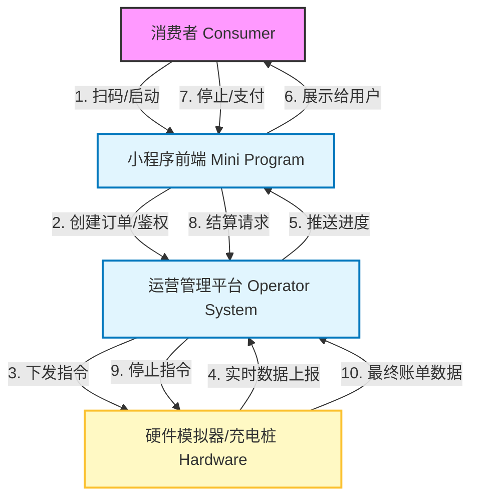
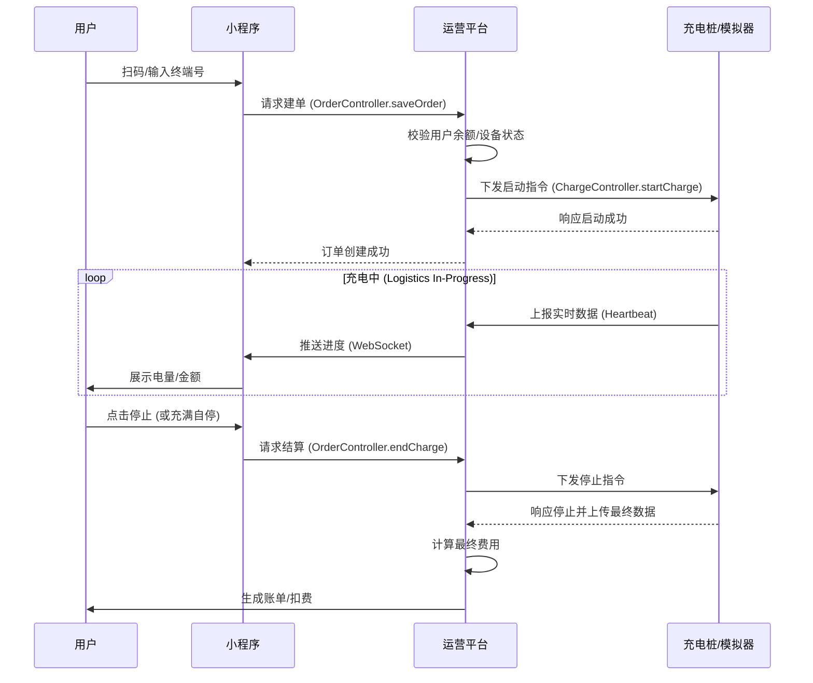

# 01-整体业务蓝图 (Overall Business Blueprint)

## 1. 业务全景概览 (Business Landscape)

本系统虽然基于电动汽车充电业务构建，但其核心逻辑完全遵循标准的**新零售/电商+物流配送**模型。为了便于非技术背景的产品经理理解，我们将核心实体映射如下：

| 电动汽车业务实体 | 新零售/物流业务映射 | 说明 |
| :--- | :--- | :--- |
| **充电站 (Station)** | **门店/前置仓 (Store/Warehouse)** | 提供服务的物理场所，管理库存（电能容量）和设施。 |
| **充电桩 (Pile/Device)** | **配送单元/物流节点 (Delivery Unit)** | 实际执行“发货”（充电）任务的硬件终端。 |
| **充电枪 (Port/Connector)** | **货架/提货口 (Shelf/Pickup Point)** | 用户与服务交互的具体接触点。 |
| **电量 (Electricity)** | **商品 (Goods)** | 用户购买的核心标的，按量计费。 |
| **充电订单 (Charging Order)** | **销售订单 (Sales Order)** | 记录交易详情、状态流转和资金结算的契约。 |
| **实时充电数据 (Heartbeat)** | **物流轨迹 (Logistics Tracking)** | 实时反馈“配送”进度（电压、电流、已充金额）。 |

## 2. 核心业务场景划分 (Core Scenarios)

基于上述映射，我们将系统业务拆分为以下六大核心场景，每个场景将在后续文档中详细展开：

1.  **下单场景 (Ordering)**: 用户扫码或选择终端，发起服务请求，系统创建订单并校验前置条件。
2.  **支付场景 (Payment)**: 包含账户充值（预存）和订单结算（扣款），确保资金流转闭环。
3.  **发货/物流场景 (Logistics/Charging)**: 硬件终端执行充电任务，实时上报进度数据，前端实时展示。
4.  **售后/退款场景 (After-sales/Refund)**: 用户主动停止或充满自停，系统结算实际费用，多退少补（如有预付）。
5.  **异常与风控场景 (Exception/Risk)**: 设备故障、网络中断、余额不足等异常情况的拦截与补偿。
6.  **对账与清算场景 (Reconciliation)**: 平台与运营商、平台与用户之间的资金核对（本期重点在订单结算）。

## 3. 业务全景用例图 (Business Use Case Diagram)

以下图表展示了主要参与角色及其核心交互行为。

## 4. 系统边界与职责 (System Boundaries)

| 系统模块 | 角色定位 | 核心职责 |
| :--- | :--- | :--- |
| **hcp-mp (小程序服务端)** | **前台/导购 (Store Front)** | 处理用户交互，展示商品（站点/桩），接收用户指令（开始/停止），发起支付。 |
| **hcp-operator (运营平台)** | **中台/ERP (Core Logic)** | 订单管理，费率计算，状态机流转，设备管理，用户余额管理。 |
| **hcp-simulator (模拟器)** | **底层/物流商 (Logistics Provider)** | 模拟真实硬件行为，响应远程指令，生成实时电压/电流数据，触发物理故障。 |

## 5. 关键业务流程概览 (High-Level Process)

## 6. 后续文档索引

*   **02-场景A-下单与支付业务**: 深入分析订单创建、前置校验及账户充值逻辑。
*   **03-场景B-发货与售后业务**: 详解充电过程监控、停止结算及异常处理。
*   **04-数据模型与状态流转**: 核心实体关系图与订单状态机。
*   **05-异常与补偿机制**: 系统如何处理启动失败、通讯中断等问题。
*   **06-优化与扩展设计**: 针对当前系统的改进建议。
