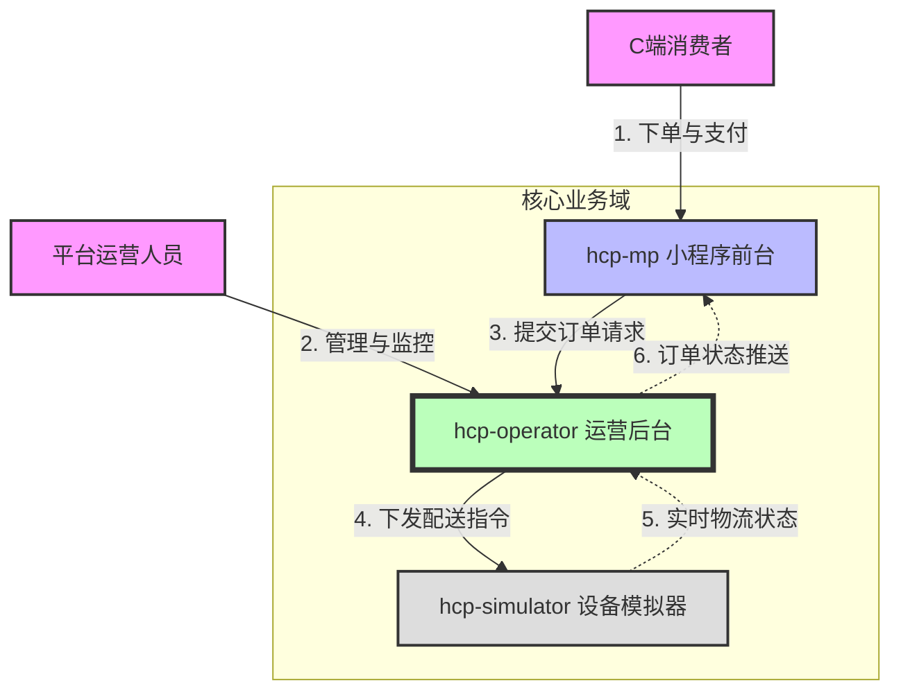
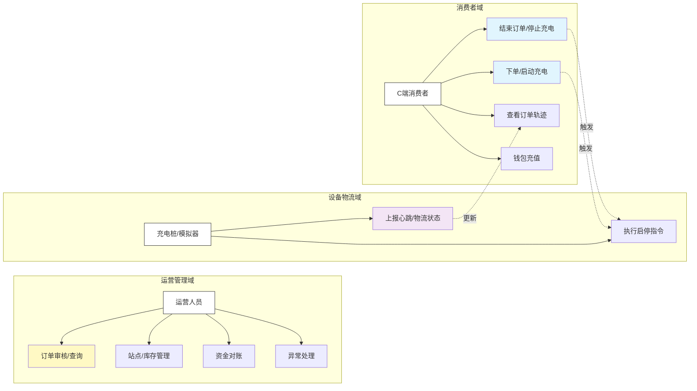

# 01-整体业务蓝图 (Overall Business Blueprint)

本文档旨在为非技术背景的产品经理梳理核心业务逻辑。我们将以标准的**零售电商与物流配送**模型来类比当前的充电业务系统，以便更直观地理解各模块的职责。

## 1. 业务全景图 (Business Panorama)

本系统本质上是一个**能源零售与即时配送平台**。

*   **商品**：电力（Energy）。
*   **下单**：用户启动充电（Place Order）。
*   **发货/物流**：充电桩输出电力（Delivery）。
*   **收货**：用户结束充电（Receive Goods）。
*   **结算**：根据实际发货量（度数）进行扣款（Settlement）。

### 核心映射关系表

| 业务概念 (零售/物流) | 系统实体 (代码映射) | 说明 |
| :--- | :--- | :--- |
| **消费者** (Consumer) | `User` / `Member` | C端用户，通过小程序操作 |
| **门店前台** (Storefront) | `hcp-mp` (Mini Program) | 用户下单、支付的入口 |
| **仓储管理系统** (WMS) | `hcp-operator` | 核心后台，管理订单、库存(桩)、结算 |
| **物流配送商** (Logistics) | `hcp-simulator` / Station | 负责实际的电力传输和硬件控制 |
| **销售订单** (Sales Order) | `ChargingOrder` | 记录交易的核心单据 |
| **钱包/账户** (Wallet) | `MenberBalance` | 用户的预存款账户 |

## 2. 参与角色 (Actors)

我们在系统中识别出以下核心角色：

1.  **C端消费者 (End User)**
    *   目标：购买电力，快速完成充电。
    *   关注点：价格透明、操作便捷、账单准确。

2.  **平台运营方 (Platform Operator)**
    *   目标：管理站点、监控订单、处理异常。
    *   关注点：设备在线率、订单转化率、资金安全。

3.  **物流/设备方 (Device/Logistics Provider)**
    *   目标：执行充电指令，上报实时数据。
    *   关注点：指令响应速度、数据准确性、安全保护。

## 3. 系统边界与交互 (System Boundaries)

为了清晰界定各系统的职责，我们使用以下上下文图（Context Diagram）来展示。

### 系统上下文图

## 4. 核心业务用例 (Core Use Cases)

以下用例图展示了不同角色在系统中的主要活动。

### 业务用例图

## 5. 设计原则与假设

1.  **异步优先**：由于涉及硬件交互（物流配送），大部分状态更新是异步的。
2.  **最终一致性**：订单状态可能与设备状态存在短暂延迟，但最终必须一致。
3.  **预付费模式**：假设当前业务主要支持余额扣款，即“先充值，后消费”。

接下来，我们将分场景详细拆解上述业务逻辑。
