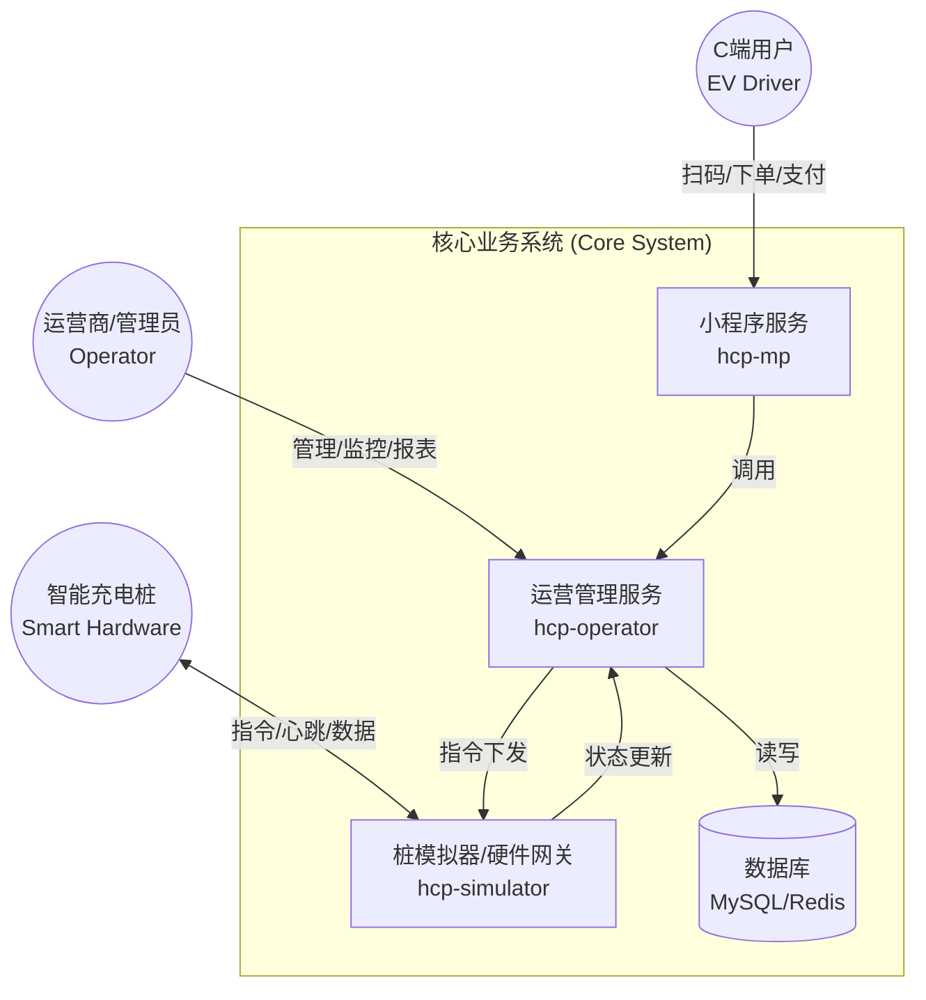

# 01-整体业务蓝图 (Overall Business Blueprint)

## 1. 业务全景图 (Business Panorama)

本项目是一个 **基于微服务架构的电动汽车充电运营平台**（EV Charging Platform）。为了便于非技术背景的产品经理理解，我们将核心业务逻辑映射到标准的 **零售/电商业务模型** 中。

### 核心映射关系 (Core Mapping)

| 电商/零售概念 | 充电桩业务对应实体 | 说明 |
| :--- | :--- | :--- |
| **门店 (Store)** | **充电站 (Station)** | 提供服务的物理场所，包含多个设备。 |
| **货架/商品 (Product)** | **充电桩/枪 (Pile/Connector)** | 具体的服务单元，库存即为“空闲状态”。 |
| **下单 (Ordering)** | **启动充电 (Start Charge)** | 用户扫码，系统校验，下达指令。 |
| **发货/物流 (Shipping)** | **实时充电 (Charging)** | 持续的服务交付过程，包含实时监控（电压/电流）。 |
| **收货 (Delivery)** | **结束充电 (Stop Charge)** | 服务完成，用户拔枪。 |
| **支付 (Payment)** | **结算扣费 (Settlement)** | 根据分时电价计算费用，从余额扣除。 |
| **售后 (After-sales)** | **故障/退款 (Fault/Refund)** | 设备故障导致的自动停止、异常扣费的退款。 |
| **会员 (Member)** | **用户 (User/Menber)** | 注册用户，拥有余额账户。 |

## 2. 场景划分 (Scenario Breakdown)

我们将业务划分为以下核心场景进行详细分析：

1.  **下单与支付场景 (Ordering & Payment)**
    *   用户扫码启动充电（下单）。
    *   预冻结金额/检查余额（风控）。
    *   充电结束自动结算（支付）。
2.  **物流与发货场景 (Logistics/Service Delivery)**
    *   实时充电监控（物流追踪）。
    *   充电桩心跳与状态上报（库存状态）。
3.  **售后与异常场景 (After-sales & Exceptions)**
    *   设备启动失败（缺货/异常）。
    *   充电中途意外停止（物流中断）。
    *   费用争议与退款。
4.  **对账与财务场景 (Reconciliation)**
    *   平台订单与支付流水核对。
    *   运营商分润结算。

## 3. 系统边界与角色 (System Boundaries & Actors)

### 核心角色 (Actors)

*   **C端用户 (EV Driver)**: 通过小程序进行扫码、充电、支付、查看订单。
*   **运营商 (Operator/Admin)**: 管理充电站、查看报表、处理异常订单。
*   **智能硬件 (Smart Hardware)**: 充电桩设备，负责执行指令并上报数据（通过 MQTT/Netty 连接）。

### 系统架构图 (System Context Diagram)



### 用例图 (Use Case Diagram)

```mermaid
usecaseDiagram
    actor "C端用户 (User)" as U
    actor "运营商 (Admin)" as A
    actor "充电桩 (Hardware)" as H

    package "充电运营平台" {
        usecase "扫码充电 (Start Charge)" as UC1
        usecase "实时监控 (Monitor Status)" as UC2
        usecase "结束充电 (Stop Charge)" as UC3
        usecase "支付结算 (Payment)" as UC4
        usecase "订单查询 (View Order)" as UC5

        usecase "站点管理 (Manage Station)" as UC6
        usecase "价格策略配置 (Set Price Rule)" as UC7
        usecase "异常处理 (Handle Fault)" as UC8

        usecase "上报心跳/状态 (Report Heartbeat)" as UC9
        usecase "上报实时数据 (Report Telemetry)" as UC10
    }

    U --> UC1
    U --> UC2
    U --> UC3
    U --> UC4
    U --> UC5

    A --> UC6
    A --> UC7
    A --> UC8

    H --> UC9
    H --> UC10

    UC1 ..> UC9 : 依赖设备在线
    UC3 ..> UC4 : 触发
```

## 4. 关键假设 (Key Assumptions)

1.  **支付模式**: 当前系统主要采用 **余额预充值** 模式。用户先充值到平台余额（`MenberBalance`），充电结束时直接扣除余额。实际的微信/支付宝支付发生在“充值”阶段，而非“结算”阶段。
2.  **硬件交互**: 系统包含 `hcp-simulator` 模块， implying 实际部署中可能使用模拟器进行测试，或者该模块作为硬件网关（Gateway）适配真实硬件协议。
3.  **拼写说明**: 代码中存在 `Menber` (Member) 的拼写习惯，文档中将尽量纠正为 `Member` 或注明。

---
**下一步**: 详细分析 **下单与支付场景**。
