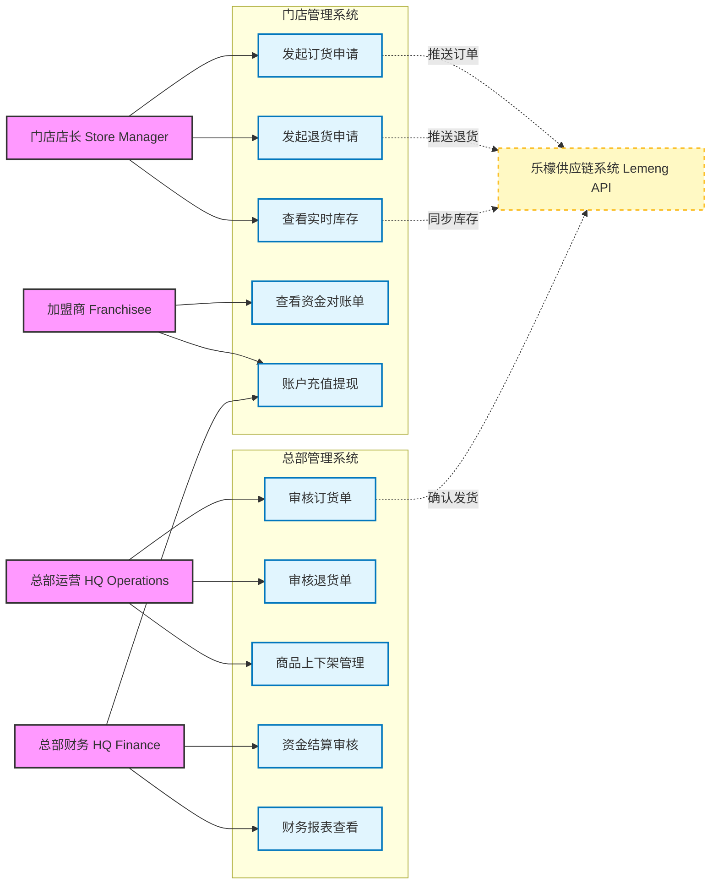

# 01. 角色与核心用例分析 (Roles & Use Cases)

> **文档受众**: 产品经理、业务方
> **核心目标**: 明确各端业务角色、系统权限边界及核心交互场景。

## 1. 业务角色定义 (Business Roles)

| 角色名称 | 英文标识 | 职责描述 | 系统入口 |
| :--- | :--- | :--- | :--- |
| **门店店长** | `Store Manager` | 负责门店日常运营，包括发起订货、申请退货、查看库存及对账单。 | 门店管理后台 (Store Admin) |
| **加盟商** | `Franchisee` | 负责门店资金往来，查看结算单据、发起充值或提现申请。 | 门店管理后台 (Store Admin) |
| **总部运营** | `HQ Operations` | 负责审核门店订单、退货申请，监控供应链异常，管理商品上下架。 | 总部管理后台 (HQ Admin) |
| **总部财务** | `HQ Finance` | 负责审核资金结算单，处理加盟商提现与充值，监控整体资金流。 | 总部管理后台 (HQ Admin) |
| **乐檬系统** | `Lemeng System` | 外部集成系统，负责实际的供应链履约[发货/退货/库存管理]。 | 开放接口 (Open API) |

## 2. 核心用例视图 (Core Use Cases)

以下图表展示了核心角色与系统各功能模块的交互关系。

## 3. 权限边界说明

1.  **门店与总部边界**:
    - **门店**: 仅负责发起业务单据（订货、退货）和查看自身数据。
    - **总部**: 负责审核单据，具有全局商品管理和资金结算权限。

2.  **自研与乐檬边界**:
    - **自研系统**: 负责业务流转（订单状态、审批流）、资金结算（账户余额、扣款）、用户权限。
    - **乐檬系统**: 负责实物库存管理、物流发货、实际退货入库。自研系统仅通过 API 同步乐檬的状态。

3.  **资金结算权限**:
    - 加盟商充值进入平台资金池。
    - 订货时，系统预冻结资金；发货确认后，实际扣款。
    - 退货时，乐檬确认收货后，系统自动生成退款单，财务审核后退回余额。
