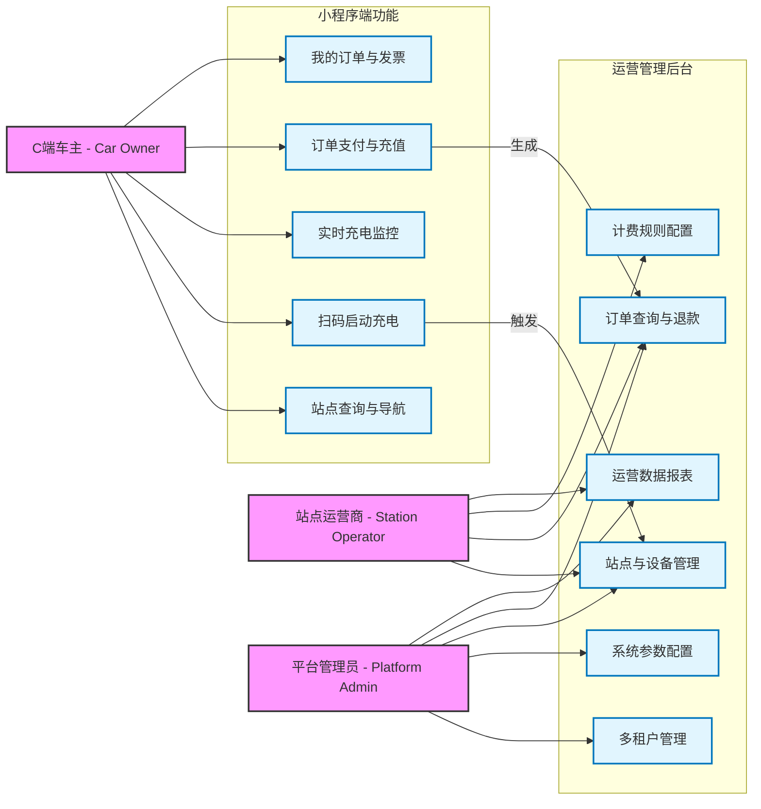

# 01. 角色与核心用例分析 (Roles & Use Cases)

> **文档受众**: 产品经理、业务方
> **核心目标**: 明确各端业务角色、系统权限边界及核心交互场景。

## 1. 业务角色定义 (Business Roles)

| 角色名称 | 英文标识 | 职责描述 | 系统入口 |
| :--- | :--- | :--- | :--- |
| **C端车主** | `Car Owner` | 新能源汽车车主，需查找充电站、扫码充电、支付费用及查看订单。 | 微信小程序 (Mini Program) |
| **站点运营商** | `Station Operator` | 负责具体充电站点的日常运营，包括设备监控、故障报修、查看站点营收数据。 | 运营管理后台 (Web Admin) - 租户视角 |
| **平台管理员** | `Platform Admin` | 总部管理人员，负责多租户管理、全局计费策略、系统配置及财务结算。 | 运营管理后台 (Web Admin) - 总部视角 |
| **运维人员** | `Maintenance Staff` | 负责充电桩硬件安装、调试及现场维修。 | 运营管理后台 / 运维App (如有) |

## 2. 核心用例视图 (Core Use Cases)

以下图表展示了三大核心角色与系统各功能模块的交互关系。

## 3. 权限边界说明

1.  **多租户隔离**:
    - `平台管理员` 可查看所有租户数据。
    - `站点运营商` 仅能查看归属于自己租户 (TenantId) 下的站点、设备和订单数据。

2.  **资金结算权限**:
    - C端车主充值进入平台资金池 (或直接支付)。
    - 退款操作需由 `站点运营商` 发起申请，或由 `平台管理员` 直接处理 (视配置而定)。
    - `计费规则` 由运营商配置，但需平台审核或符合平台指导价 (配置项)。

3.  **设备控制权限**:
    - 远程启动/停止充电：`平台管理员` 和 `站点运营商` 均有权限 (用于处理异常订单)。
    - 固件升级/参数下发：通常仅限 `平台管理员` 或高级 `运维人员`。
