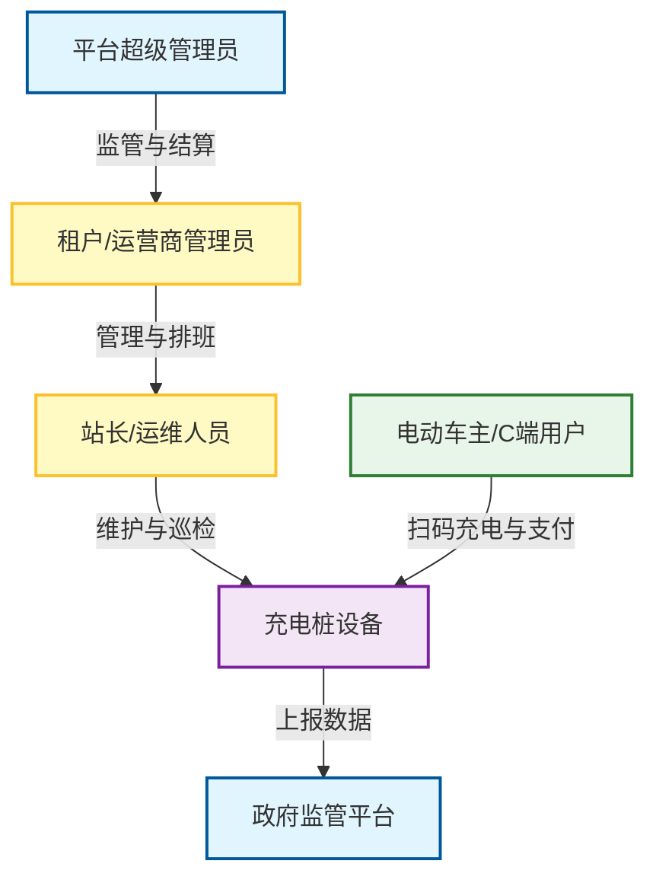
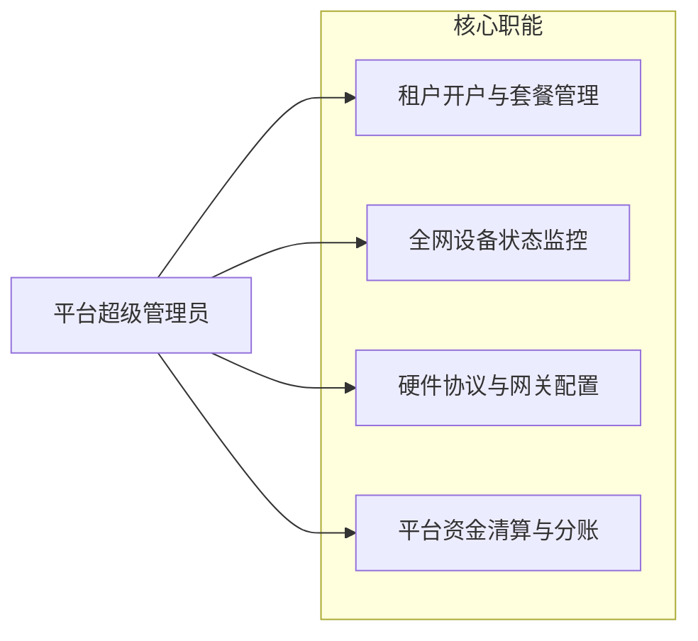
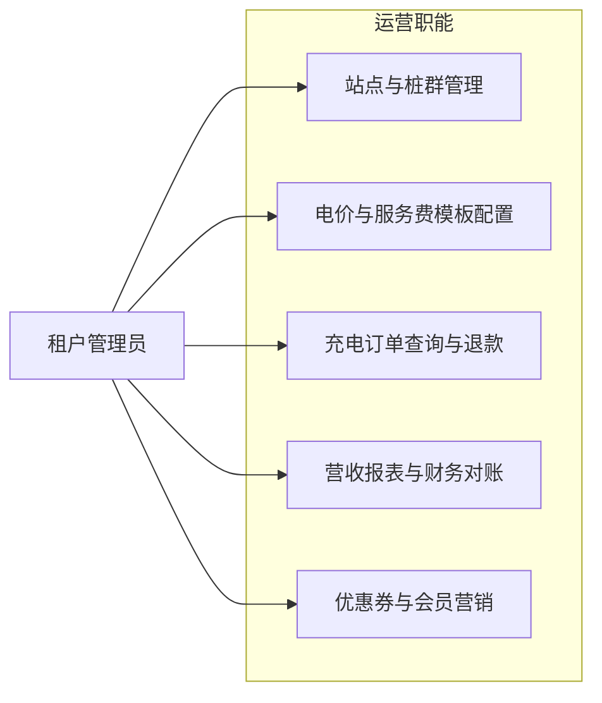
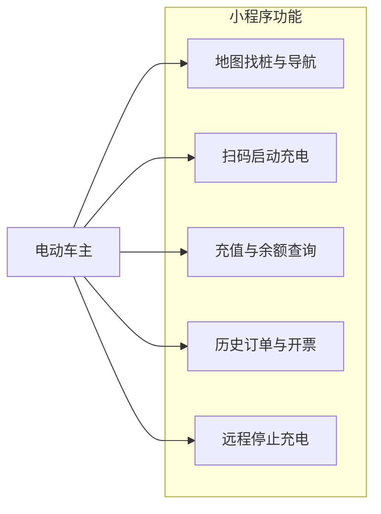
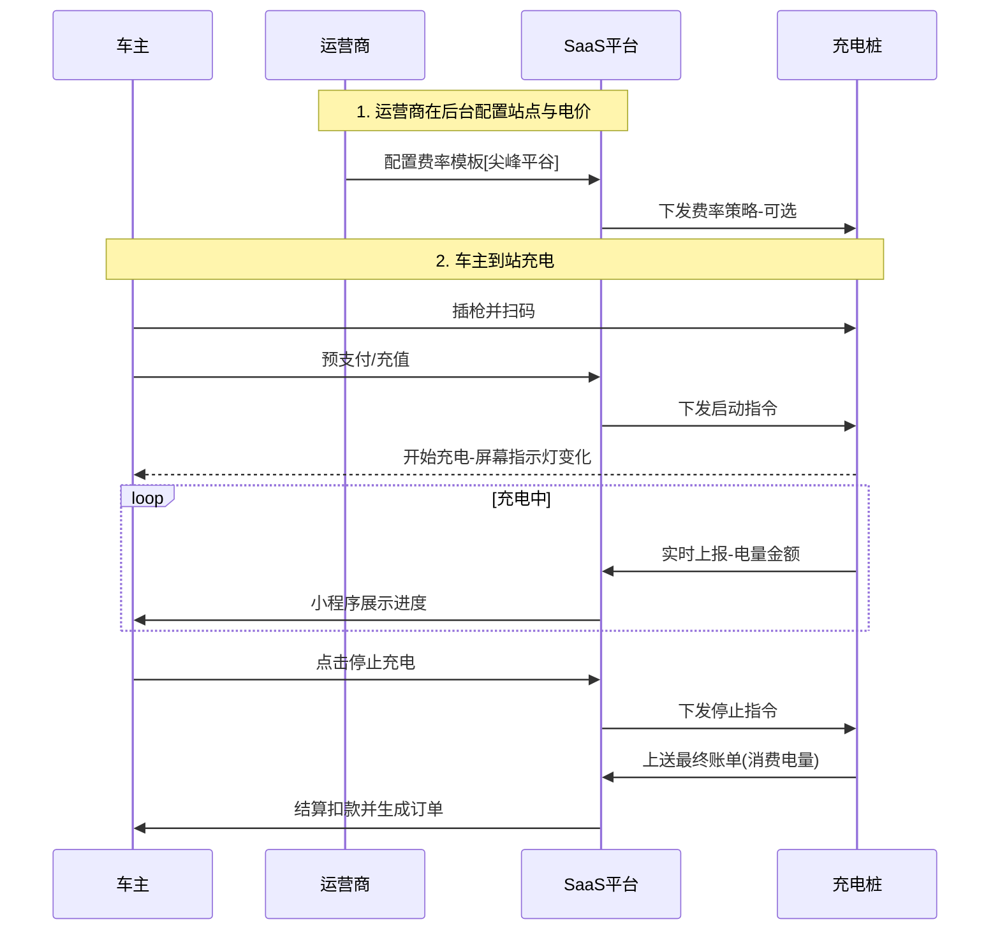

# 用户角色与用例 (Roles & Use Cases)

本文档旨在梳理“慧知开源充电桩平台”的核心参与者及其关键业务诉求。通过可视化图表，帮助产品经理快速理解“谁在使用系统”以及“他们要做什么”。

## 1. 核心角色概览 (Role Overview)

系统采用 **SaaS 多租户架构**，核心角色分为三层：平台运营层、租户运营层、终端使用层。此外，还涉及硬件设备与外部监管方。

## 2. 角色用例详解 (Detailed Use Cases)

### 2.1 平台运营方 (Platform Admin)
**定位**：SaaS 平台的拥有者，负责技术底座维护、全局资金归集、以及对租户（运营商）的监管。

### 2.2 租户/运营商 (Tenant Operator)
**定位**：具体的充电站经营者（如某物业公司、某公交公司），拥有自己的充电桩资产，自负盈亏。

- **核心诉求**：
    1.  **灵活定价**：支持分时电价（尖峰平谷）、会员价、阶梯电价。
    2.  **营收可视**：实时查看今日收入、订单详情。
    3.  **设备管理**：远程重启、下发升级、查看故障。

### 2.3 终端用户/车主 (End User)
**定位**：使用微信/支付宝小程序进行充电的C端用户。

### 2.4 充电桩硬件 (Charging Pile)
**定位**：执行指令的哑终端（Dumb Terminal），需保持与云端的长连接。

- **关键行为**：
    -   **心跳 (Heartbeat)**：每隔 N 秒向云端报活。
    -   **鉴权 (Auth)**：刷卡或扫码时请求云端鉴权。
    -   **遥测 (Telemetry)**：充电中实时上报电压、电流、功率。
    -   **告警 (Alarm)**：急停按下、过温、过压时立即上报。

---

## 3. 业务协同总览 (Collaboration Overview)

各角色在一次完整的“充电服务”中的协同关系如下：

