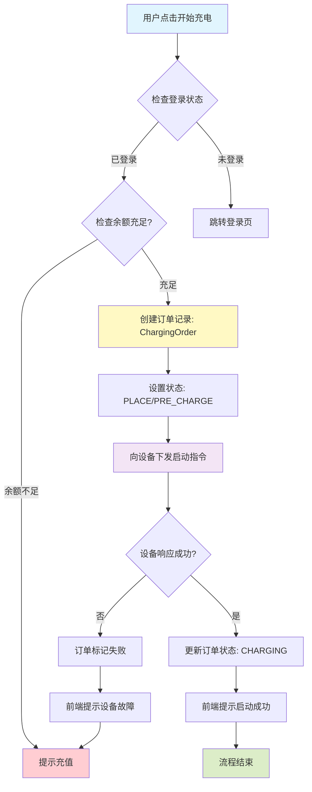
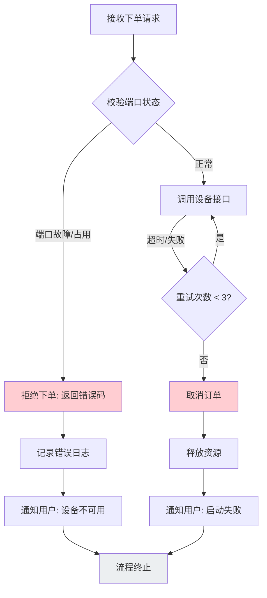
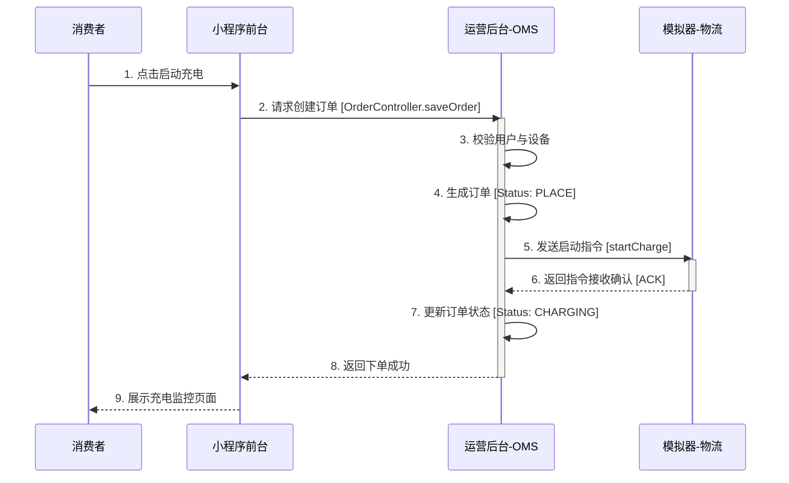
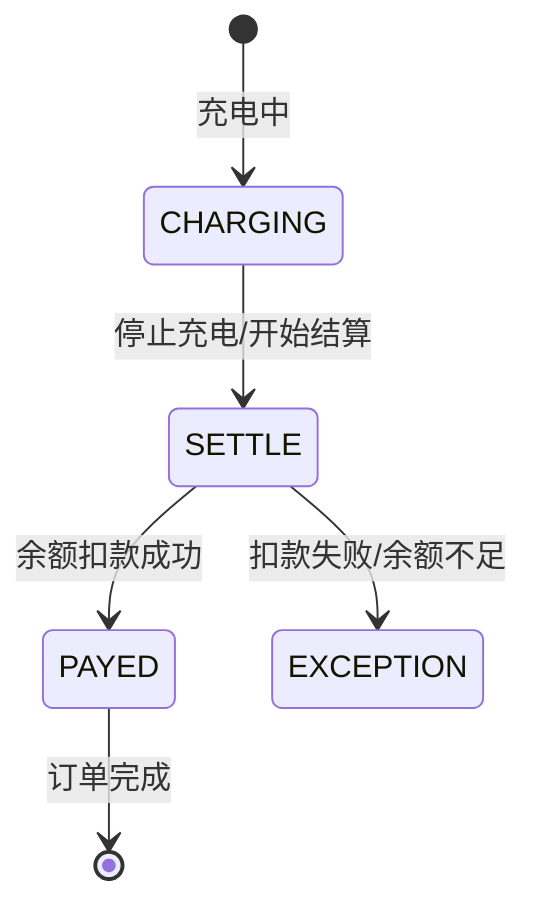

# 02-场景：下单与支付 (Ordering & Payment)

本章节详细拆解**C端用户下单（启动充电）**与**支付结算**的完整业务流程。我们将此过程类比为**用户在电商平台下单购买即时配送商品**。

## 场景一：下单（启动充电）

### 1. 场景概述
*   **场景目标**：用户通过小程序成功创建订单，并触发设备开始供电。
*   **参与角色**：消费者 (User)、前台应用 (MP)、订单中心 (Operator)、物流设备 (Simulator)。
*   **触发条件**：用户在小程序点击“开始充电”按钮。
*   **前置条件**：用户已登录，账户余额充足，且所选充电桩（库存）状态为空闲。

### 2. 正向流程 (Happy Path)

这是最理想的路径，所有校验通过，设备成功启动。

#### 业务活动图 (Activity Diagram - Forward)

### 3. 逆向流程 (Exception Path)

当遇到库存不足（桩被占用）或系统异常时的处理逻辑。

#### 业务活动图 (Activity Diagram - Reverse)

### 4. 系统交互时序图 (Sequence Diagram)

展示各系统间的数据流转。

---

## 场景二：支付结算 (Payment & Settlement)

### 1. 场景概述
*   **场景目标**：根据实际充电量计算费用，并从用户余额中扣除。
*   **触发条件**：充电结束（用户主动停止 或 充满自停）。
*   **数据流转**：设备上报最终读数 -> 后台计算 -> 扣款 -> 更新订单。

### 2. 状态变化 (State Machine)

订单在支付环节的状态流转。

### 3. 核心数据流

*   **输入数据**：开始时间、结束时间、总电量 (kWh)。
*   **计算公式**：`总费用 = (电费单价 * 电量) + (服务费单价 * 电量)`。
*   **输出数据**：实扣金额、订单最终状态。

### 4. 优化建议

1.  **预冻结机制**：当前流程是结束后扣款，存在坏账风险。建议在下单时冻结预估金额（如50元）。
2.  **分时计费**：支持尖峰平谷电价计算，需在订单创建时锁定费率快照。
