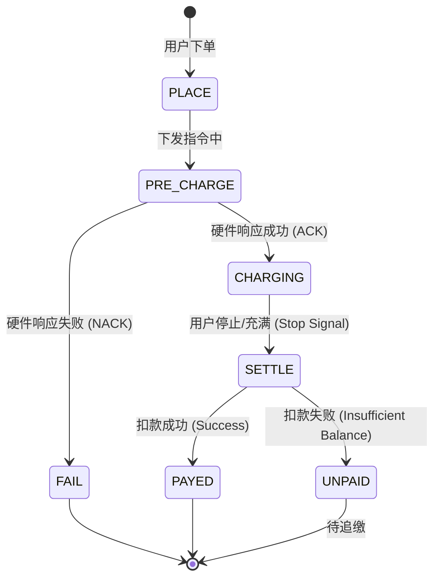
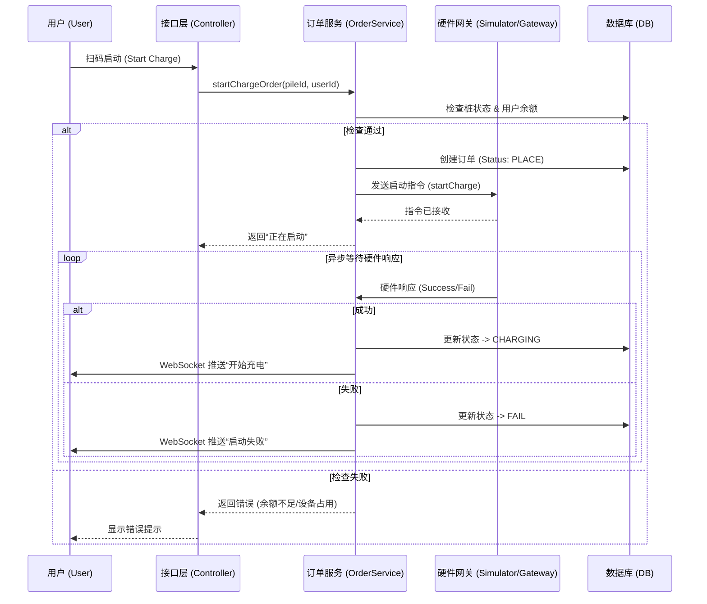

# 02-场景：下单与支付业务 (Ordering & Payment Scenario)

本章节详细分析用户 **启动充电 (下单)** 和 **结束充电结算 (支付)** 的完整业务流程。

## 1. 场景概述 (Overview)

### 1.1 场景目标
*   **下单**: 用户扫码后，系统校验通过并成功启动充电桩，生成进行中的订单。
*   **支付**: 用户或系统结束充电，系统根据分时计费规则自动计算费用，并从用户余额中扣除。

### 1.2 参与角色 (Actors)
*   **用户 (EV Driver)**: 发起充电请求，确认支付。
*   **运营平台 (Platform/Operator)**: 核心业务逻辑，负责鉴权、计费、指令下发。
*   **充电桩 (Hardware/Device)**: 执行开关机指令，上报电量数据。
*   **账户系统 (Account System)**: 管理用户余额 (`MenberBalance`)。

### 1.3 前置条件 (Pre-conditions)
*   用户已登录且账户余额充足（部分站点可能要求预充值）。
*   充电桩状态为“空闲”且在线。
*   充电枪已连接车辆（物理连接确认）。

---

## 2. 正向流程分析 (Forward Process - Happy Path)

### 2.1 下单流程 (Start Charging)

**核心逻辑**:
1.  用户请求启动。
2.  系统校验桩状态与用户余额。
3.  创建订单，状态为 `PLACE` (已下单)。
4.  下发“启动充电”指令给硬件。
5.  硬件响应成功，订单状态更新为 `CHARGING` (充电中)。

#### 活动图 (Activity Diagram - Start Charge)

```mermaid
activityDiagram
    start
    :用户扫码/点击“启动充电”;
    partition "运营平台 (Platform)" {
        :校验用户登录状态;
        :校验账户余额 (Risk Control);
        if (余额充足?) then (Yes)
            :校验充电桩状态 (Station Check);
            if (桩在线且空闲?) then (Yes)
                :生成订单 (Order State: PLACE);
                :记录订单日志 (Order Log);
                :下发启动指令 (Send Command);
            else (No)
                :提示“设备不可用”;
                stop
            endif
        else (No)
            :提示“余额不足，请充值”;
            stop
        endif
    }
    partition "智能硬件 (Hardware)" {
        :接收启动指令;
        :执行继电器闭合;
        :检测车辆连接 (BMS Check);
        if (启动成功?) then (Yes)
            :返回启动成功 ACK;
        else (No)
            :返回启动失败 NACK;
        endif
    }
    partition "运营平台 (Platform)" {
        if (收到成功 ACK?) then (Yes)
            :更新订单状态 (Order State: CHARGING);
            :开始计费计时;
            :推送“开始充电”消息给用户;
        else (No)
            :更新订单状态 (Order State: FAIL);
            :触发退款/解锁逻辑;
        endif
    }
    stop
```

### 2.2 支付结算流程 (Stop & Payment)

**核心逻辑**:
1.  收到停止信号（用户主动停止或电池充满自动停止）。
2.  下发“停止充电”指令。
3.  硬件上报最终电量数据。
4.  系统计算费用（电费 + 服务费）。
5.  扣除用户余额，更新订单为 `PAYED` (已支付)。

#### 活动图 (Activity Diagram - Stop & Pay)

```mermaid
activityDiagram
    start
    :触发停止 (用户App / BMS充满 / 拔枪);
    partition "运营平台 (Platform)" {
        :下发停止指令;
    }
    partition "智能硬件 (Hardware)" {
        :断开继电器;
        :上报最终电量/时间 (Final Data);
    }
    partition "运营平台 (Platform)" {
        :接收最终数据;
        :计算充电时长;
        :应用分时电价规则 (Peak/Valley Pricing);
        :计算总费用 (Total = Energy Fee + Service Fee);

        partition "账户系统 (Account)" {
            :冻结/扣除余额;
            if (扣款成功?) then (Yes)
                :更新订单状态 (Order State: PAYED);
                :生成消费流水;
            else (No)
                :更新订单状态 (Order State: UNPAID);
                :标记为欠费订单;
            endif
        }
        :推送账单详情给用户;
    }
    stop
```

---

## 3. 逆向流程与异常处理 (Reverse Process & Exceptions)

### 3.1 启动失败 (Start Failure)

如果硬件启动失败（如车辆未插好枪、硬件故障），系统必须回滚订单状态，避免用户被锁定。

#### 活动图 (Activity Diagram - Start Fail)

```mermaid
activityDiagram
    start
    :平台下发启动指令;
    partition "智能硬件 (Hardware)" {
        :尝试启动;
        :检测到故障 (如绝缘检测失败);
        :上报启动失败 (Reason Code);
    }
    partition "运营平台 (Platform)" {
        :接收失败报文;
        :查找对应订单 (State: PLACE);
        :更新订单状态 -> FAIL (启动失败);
        :记录异常原因 (Error Log);
        if (存在预冻结金额?) then (Yes)
            :发起自动解冻/退款;
        endif
        :通知用户“启动失败，请检查设备”;
    }
    stop
```

---

## 4. 状态机设计 (State Machine)

订单状态流转是业务核心。以下是 `ChargingOrder` 的生命周期。



## 5. 系统交互时序图 (Sequence Diagram)

展示 `ChargingOrderServiceImpl` 与外部系统的交互细节。



## 6. 数据流转路径 (Data Flow)

1.  **下单阶段**: `User Request` -> `ChargingController` -> `ChargingOrderService` -> `Insert DB (hlht_charge_order_info)` -> `Simulator`.
2.  **结算阶段**: `Hardware Report` -> `Simulator` -> `ChargingOrderService.handleOrderInfo()` -> `Update DB (End Time, Power)` -> `MenberBalanceService.deduct()` -> `Update DB (Status=PAYED)`.

## 7. 系统边界与可优化点 (Optimization)

*   **当前边界**: 支付依赖于内部余额 (`MenberBalance`)，未直接集成微信支付分/支付宝信用分（先充后付）。
*   **优化点**:
    *   引入 **信用支付**: 允许信用分高的用户“先充后付”，减少预充值门槛。
    *   **并发锁**: 在扣款环节增加分布式锁，防止并发请求导致余额扣减异常。
    *   **幂等性**: 硬件上报的“停止信号”可能重复，需确保结算逻辑幂等（只扣一次费）。
