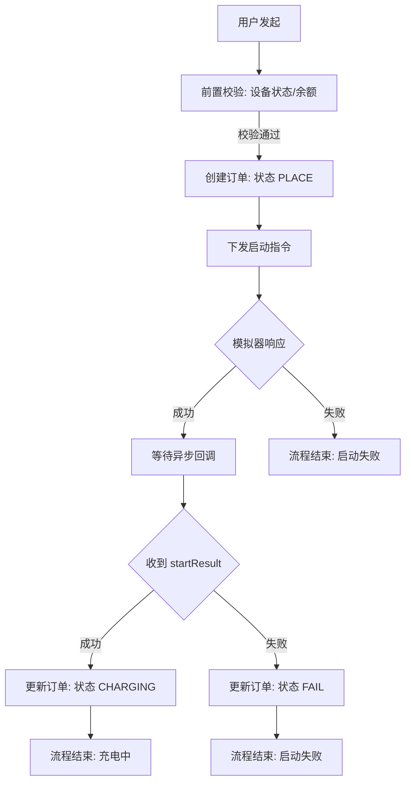
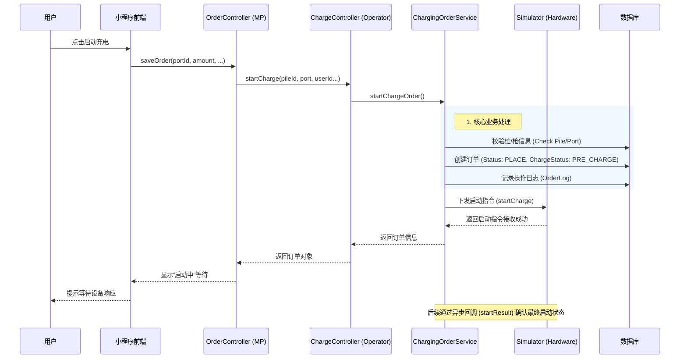
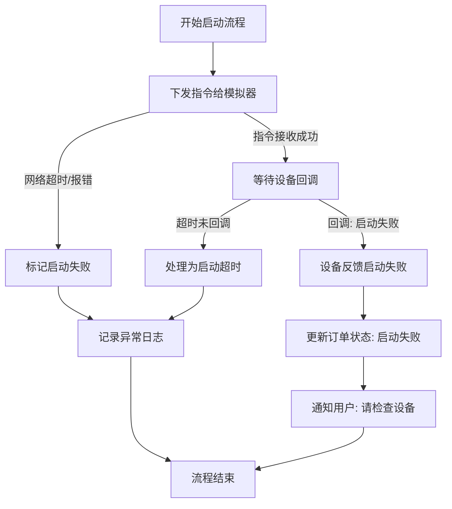
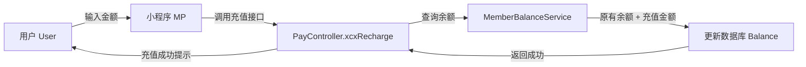

# 02-场景A-下单与支付业务 (Ordering & Payment Scenarios)

本章节详细分析用户发起充电请求（下单）以及账户充值（支付）的核心业务逻辑。

## 1. 下单场景 (Ordering Scenario)

### 1.1 场景描述
用户在小程序端扫描充电桩二维码或输入终端号，发起充电请求。系统需校验设备状态，创建“销售订单”，并指令硬件设备开始“发货”（输出电流）。

*   **场景目标**: 成功创建充电订单并启动充电桩。
*   **参与角色**: 用户、小程序 (MP)、运营平台 (Operator)、充电桩/模拟器 (Simulator)。
*   **触发条件**: 用户点击“启动充电”按钮，调用 `OrderController.saveOrder`。
*   **前置条件**: 用户已登录，充电桩在线且空闲。

### 1.2 正向流程 (Happy Path)

#### 1.2.1 业务活动图 (Activity Diagram)

#### 1.2.2 系统时序图 (Sequence Diagram)

### 1.3 逆向流程 (Exception Path) - 启动失败

当硬件设备无法响应或拒绝启动时（如枪未插好），系统需处理异常。

### 1.4 数据流转与状态变化

*   **初始状态**: 订单创建时为 `PLACE` (已下单)。
*   **中间状态**: 调用模拟器后，订单包含 `PRE_CHARGE` (预启动) 标记。
*   **成功状态**: 收到设备 `startResult` 回调成功后，变更为 `CHARGING` (充电中)。
*   **关键数据**:
    *   `pileId`, `port`: 确定物理位置。
    *   `orderNumber`: 全局唯一交易凭证。
    *   `userId`: 归属用户。

### 1.5 代码映射 (Code Mapping)

| 逻辑步骤 | 代码位置 | 说明 |
| :--- | :--- | :--- |
| **入口** | `hcp-mp/.../OrderController.java` | 方法 `saveOrder`，接收前端请求。 |
| **转发** | `hcp-operator/.../ChargeController.java` | 方法 `startCharge`，微服务间调用。 |
| **建单** | `hcp-operator/.../ChargingOrderServiceImpl.java` | 方法 `startChargeOrder`，执行 DB 插入。 |
| **硬件指令** | `hcp-simulator/...` | 模拟器接收指令。 |
| **结果回调** | `hcp-operator/.../ChargeController.java` | 方法 `startResult`，接收硬件最终反馈。 |

---

## 2. 支付/充值场景 (Payment/Top-up Scenario)

### 2.1 场景描述
由于本系统目前采用“余额扣费”模式，用户需先保证账户有余额。支付场景主要指用户通过小程序充值余额。

*   **场景目标**: 增加用户账户余额 (Member Balance)。
*   **触发条件**: 用户在个人中心点击“充值”，调用 `PayController.xcxRecharge`。

### 2.2 充值流程图

### 2.3 可优化点 (Optimization)

1.  **余额前置校验**: 当前 `startChargeOrder` 逻辑中，并未显式看到“检查余额是否大于 0”的强校验代码（可能在更上层或被省略），建议在建单前增加 `Pre-Check`。
2.  **事务一致性**: 充值操作直接修改余额，建议增加“充值流水记录”表，确保资金可追溯。
3.  **支付网关集成**: 目前 `xcxRecharge` 为模拟接口，实际生产需接入微信/支付宝支付回调。
