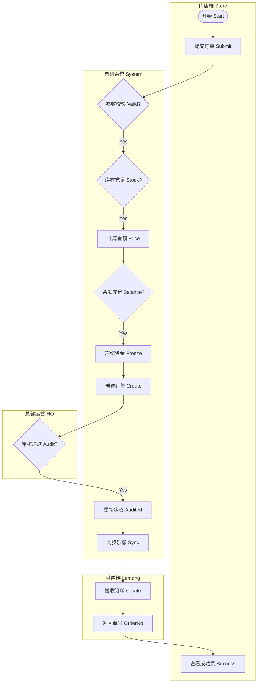
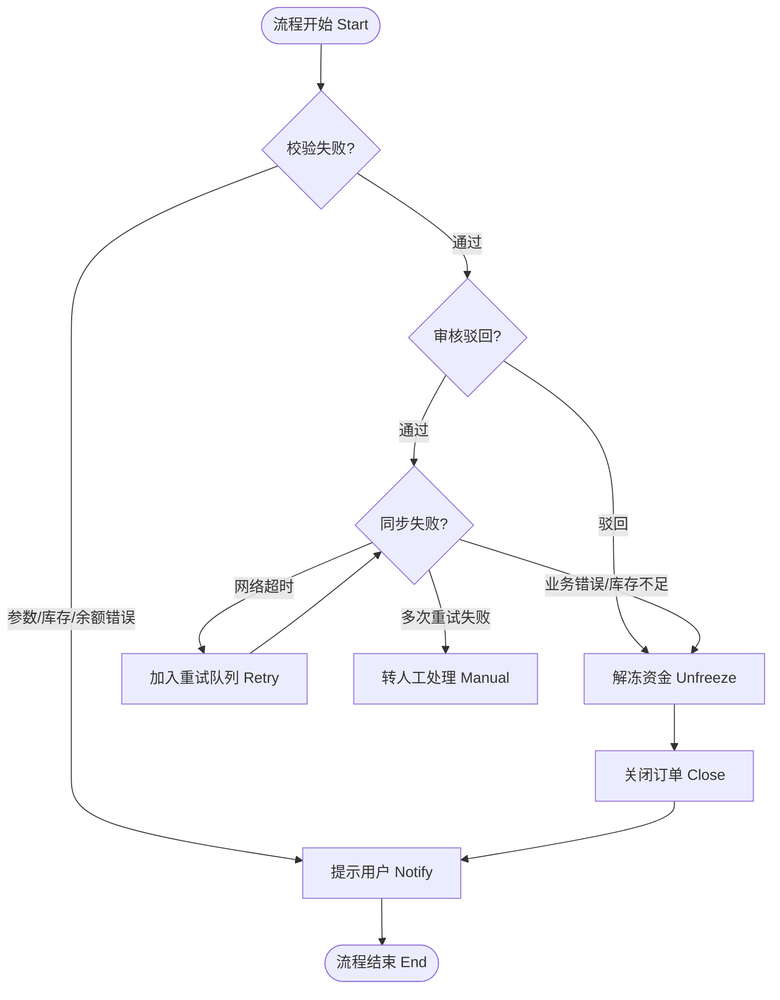
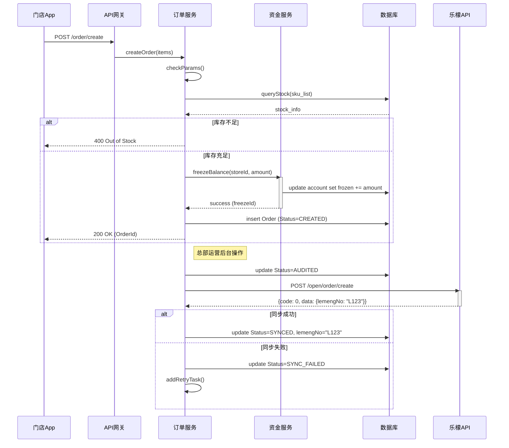

# 02. 订货与支付业务场景 (Ordering & Payment Scenario)

> **文档受众**: 产品经理、研发人员
> **核心目标**: 详细拆解门店订货流程，明确资金冻结、库存校验及总部审核逻辑。

## 1. 场景概述 (Scenario Overview)

| 维度 | 说明 |
| :--- | :--- |
| **场景名称** | 门店订货与支付（资金冻结） |
| **场景目标** | 确保门店能够根据需求发起订货，且系统能准确冻结对应资金或信用额度，防止超额订货。 |
| **参与角色** | 门店店长 (Store Manager)、总部运营 (HQ Ops)、自研系统 (System)、乐檬供应链 (Lemeng) |
| **触发条件** | 店长在 App 端提交购物车结算请求。 |
| **前置条件** | 门店状态正常（未冻结），且账户余额/信用额度充足。 |

## 2. 核心业务流程 (Core Process Flow)

### 2.1. 正向流程活动图 (Happy Path Activity Diagram)

此流程描述从提交订单到成功同步至乐檬供应链的主路径。

**为什么这样设计？**
- **先校验后冻结**: 减少无效锁单，提升性能。
- **先冻结后审核**: 确保审核通过后必然有资金支付，避免“空头支票”。
- **审核后同步**: 只有通过内部风控和人工审核的订单才推送到供应链，减少外部系统压力。

### 2.2. 逆向与异常流程活动图 (Reverse & Exception Flow)

此流程展示了当库存不足、余额不足、审核驳回或同步失败时的处理机制。

**关键设计点**:
- **原子性解冻**: 任何环节失败，必须无条件释放已冻结的资金。
- **重试机制**: 同步乐檬失败时，不直接取消，而是进入“重试队列”。

## 3. 详细时序图 (Sequence Diagram)

展示各系统组件间的交互细节，特别是资金服务的强一致性要求。

## 4. 状态流转 (State Transition)

订单状态是驱动业务的核心。

| 状态 | 英文标识 | 含义 | 下一步可能状态 | 触发动作 |
| :--- | :--- | :--- | :--- | :--- |
| **已创建** | `CREATED` | 订单已生成，资金已冻结，待审核。 | AUDITED, REJECTED, CANCELLED | 门店下单 |
| **已审核** | `AUDITED` | 总部审核通过，待同步乐檬。 | SYNCED, SYNC_FAILED | 运营审核 |
| **已驳回** | `REJECTED` | 总部审核不通过，资金已解冻。 | (终态) | 运营驳回 |
| **已同步** | `SYNCED` | 成功推送到乐檬系统。 | SHIPPED, PARTIAL_SHIPPED | 系统同步 |
| **同步失败** | `SYNC_FAILED` | 推送乐檬失败（网络/参数）。 | SYNCED, CANCELLED | 系统同步 |
| **已取消** | `CANCELLED` | 门店主动取消或同步失败导致取消。 | (终态) | 门店取消/系统取消 |

## 5. 数据流转与关键字段

1.  **输入数据**: 门店ID、SKU列表、数量、收货地址。
2.  **过程数据**: 冻结流水号 (`freezeId`)、审核备注 (`auditRemark`)。
3.  **输出数据**: 自研订单号 (`orderNo`)、乐檬订单号 (`lemengNo`)。

## 6. 系统边界与假设

- **库存假设**: 本阶段仅做自研系统的“镜像库存”校验，最终以乐檬下单接口返回的结果为准。若乐檬返回缺货，则走“同步失败”流程并解冻资金。
- **价格假设**: 商品价格以自研系统维护的价格为准，不实时拉取乐檬价格。

---
*下一篇：请阅读 `03-scenario_logistics_aftersales.md` 了解发货、售后与退款逻辑。*
