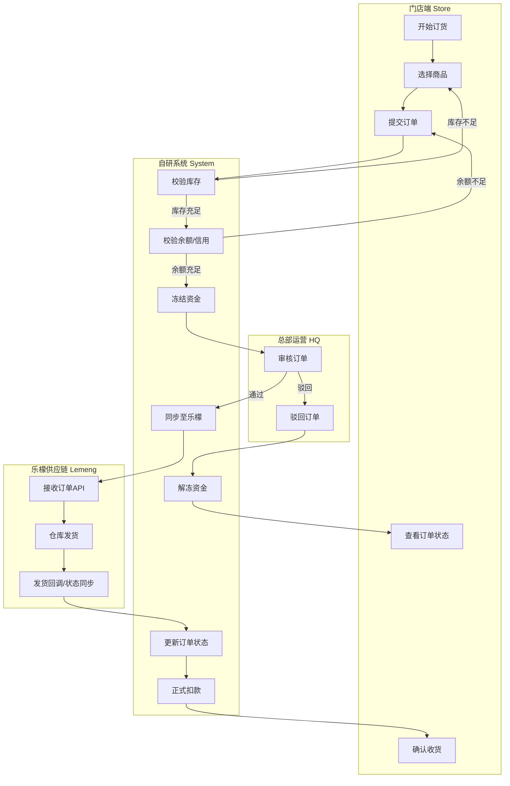
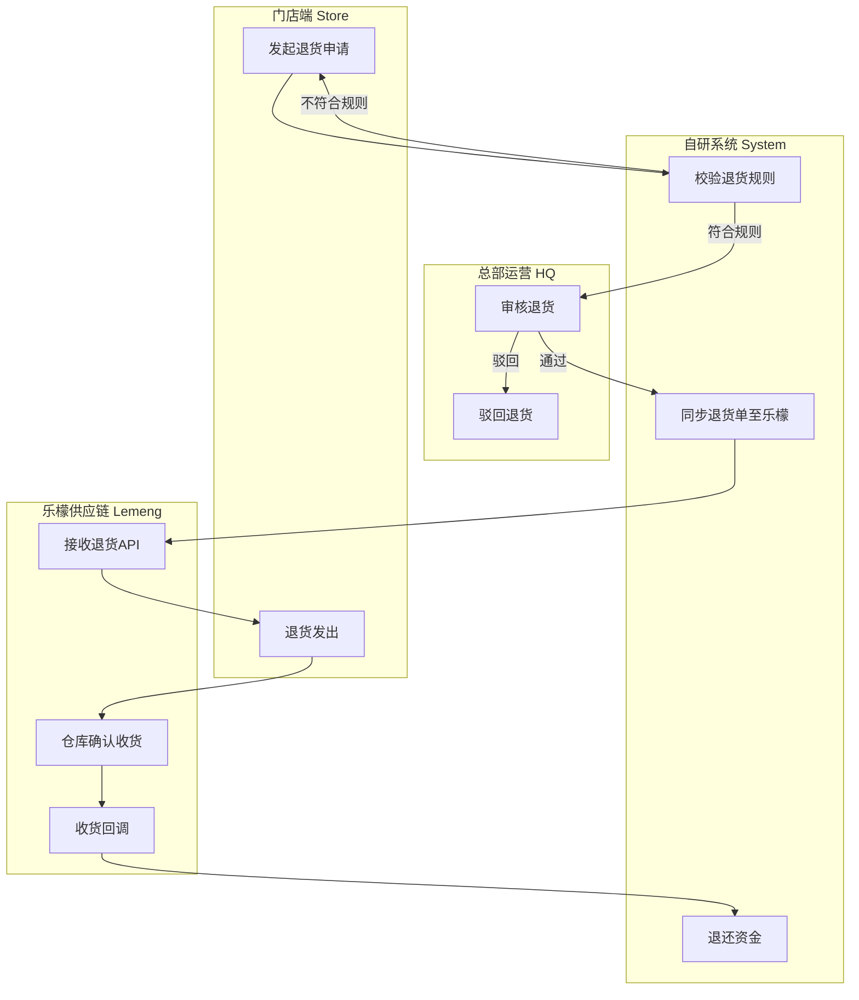
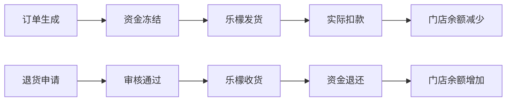

# 02. 核心业务流程 (Core Business Flows)

> **文档受众**: 产品经理、研发人员
> **核心目标**: 梳理跨端业务流转逻辑，明确关键节点的状态变更与系统交互。

## 1. 门店订货与履约流程 (Procurement Flow)

此流程描述门店发起订货到乐檬发货的全过程，包含资金冻结逻辑。

## 2. 门店退货流程 (Return Flow)

此流程描述门店发起退货申请，经审核后由乐檬进行回收的逆向流程。

## 3. 资金结算逻辑 (Fund Settlement)

资金结算贯穿订货与退货的全生命周期。

1.  **下单时**: 系统预冻结订单金额（含运费）。
2.  **发货后**: 系统根据实际发货数量进行正式扣款（解冻并扣除）。
3.  **差异处理**: 若乐檬缺货，仅扣除实际发货金额，剩余冻结资金自动解冻。
4.  **退货时**: 乐檬确认收货数量后，按原价（或折损价）退还至门店余额。

