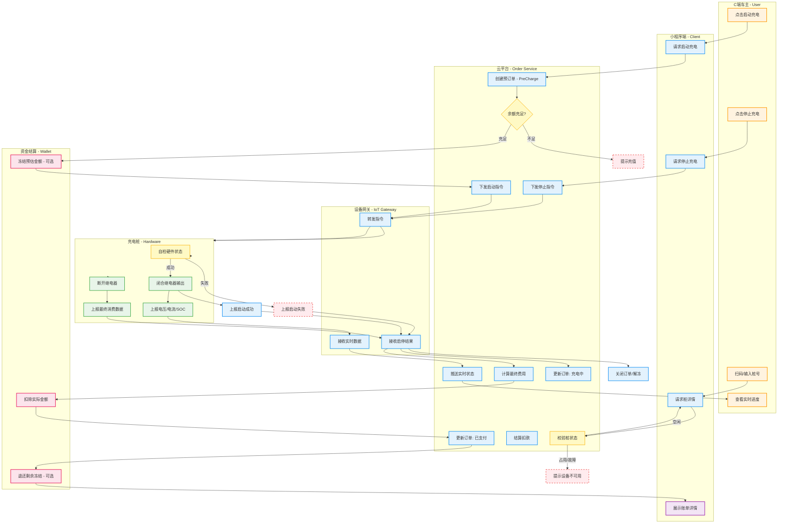

# 02. 核心业务流程与泳道图 (Core Business Flow)

> **文档受众**: 业务方、架构师
> **核心目标**: 明确核心业务（充电全生命周期）在各系统间的流转路径，包含正向流程与异常处理。

## 1. 核心业务全景 (Business Overview)

本平台最核心的业务闭环为 **"充电服务交易闭环"**。
业务主线围绕 `订单(Order)` 展开，涉及 `设备(Pile)` 控制与 `资金(Fund)` 结算。

### 1.1 关键业务节点
1.  **用户认证与充值**: 必须先登录并保证账户余额充足（预充值模式）。
2.  **扫码启动**: 校验设备状态与用户资格。
3.  **充电中监控**: 实时接收设备上报的电压、电流、SOC及累计费用。
4.  **结束结算**: 自动生成账单，扣除余额，多退少补（针对预冻结场景）。

## 2. 充电全流程泳道图 (Charging Swimlane Diagram)

本图展示了从用户扫码到结算完成的完整业务流转。

## 3. 异常与逆向流程 (Exception Flows)

### 3.1 启动失败 (Start Charge Failed)
- **场景**: 设备离线、枪头未插好、硬件故障。
- **处理**:
    1.  平台接收到设备返回的 `StartResult=Fail` 或超时未响应。
    2.  订单状态更新为 `启动失败 (StartFail)`。
    3.  **资金回滚**: 如有预冻结资金，立即触发解冻流程，原路退回用户余额。

### 3.2 异常停止 (Abnormal Stop)
- **场景**: 用户按下急停按钮、设备过温保护、网络中断。
- **处理**:
    1.  设备主动上报 `StopReason` (如: 急停、拔枪)。
    2.  平台接收后立即结算，生成订单账单。
    3.  若存在未结算金额（如网络中断导致数据丢失），平台根据最后一次心跳数据进行**兜底结算**，并在后续人工核对。

### 3.3 充值退款 (Refund)
- **场景**: 用户余额提现。
- **流程**: 用户发起申请 -> 平台运营审核 -> 财务打款 -> 扣除余额。
- **注意**: 需校验是否存在“进行中”的订单，防止恶意提现后逃单。
