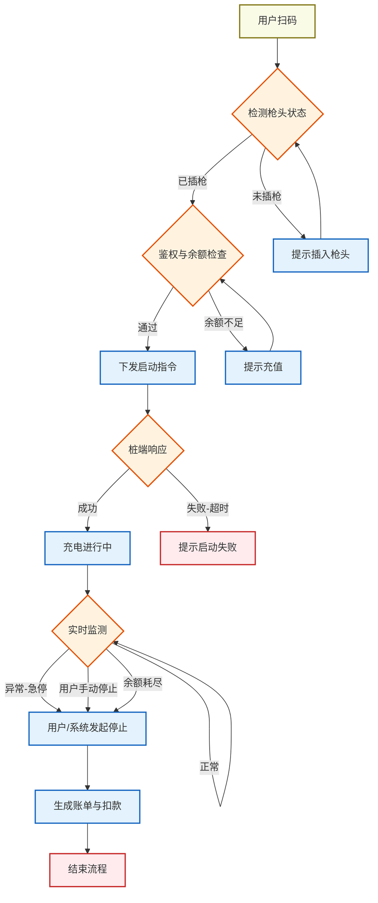
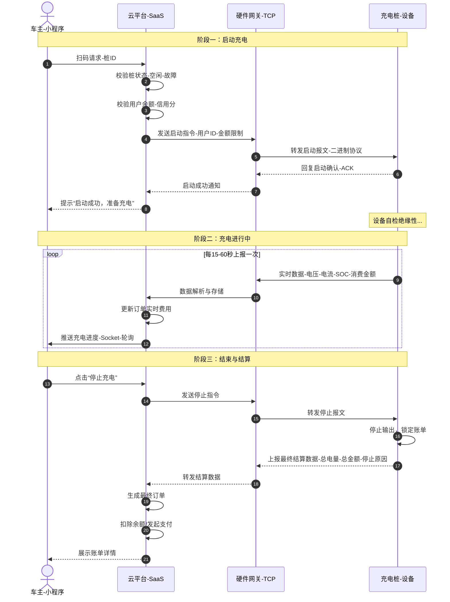
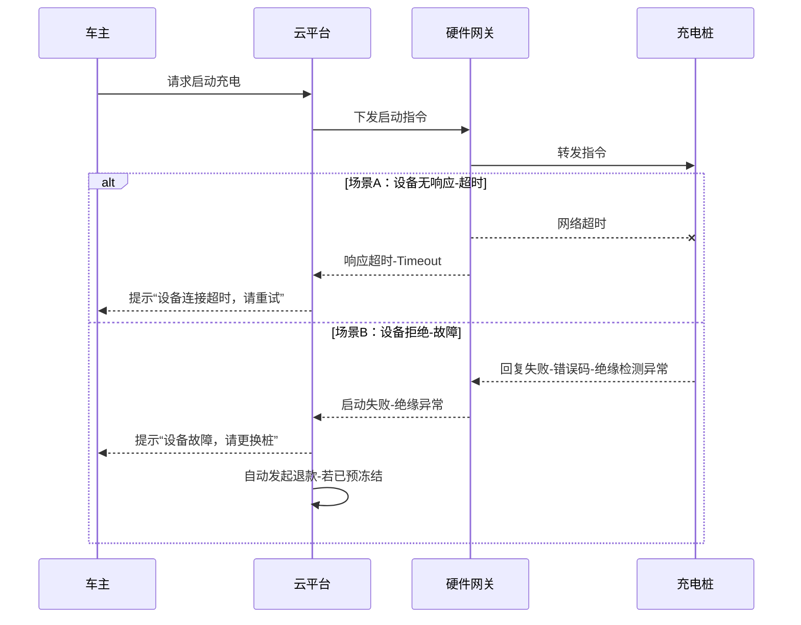

# 核心业务流 (Core Business Flow)

本文档通过详细的时序图与流程图，深度剖析“扫码充电”这一核心业务场景的全生命周期。

## 1. 扫码充电业务全景图 (Overview Flowchart)

用户从扫码到充电结束，经历了三个主要阶段：**准备阶段**、**充电阶段**、**结算阶段**。

## 2. 详细时序交互 (Detailed Sequence)

### 2.1 正向流程：启动与结算 (Start & Settlement)

### 2.2 逆向流程：启动失败 (Start Failure)

当指令下发后，设备可能因故障、网络超时或物理连接问题无法启动。

## 3. 关键业务规则 (Business Rules)

### 3.1 资金冻结与扣款
为防止“逃单”风险，通常采用两种策略：
1.  **预充值/预冻结**：启动前冻结用户账户一定金额（如30元）。充电结束时多退少补。
    -   *风险*：用户体验较差。
2.  **信用支付**：引入微信支付分或支付宝芝麻信用，先充后付。
    -   *风险*：需接入第三方信用体系。

### 3.2 异常停止策略
当出现以下情况时，云平台必须**强制下发停止指令**：
1.  **余额耗尽**：实时计费金额 >= 账户余额。
2.  **设备离线**：长时间（如5分钟）未收到设备心跳或实时数据。
3.  **运营干预**：管理员在后台手动停止。

### 3.3 掉单处理 (Offline Billing)
若充电结束时网络中断，桩端必须保存充电记录。待网络恢复后，通过“补单协议”上报云端，云端根据补单数据完成延迟结算。
