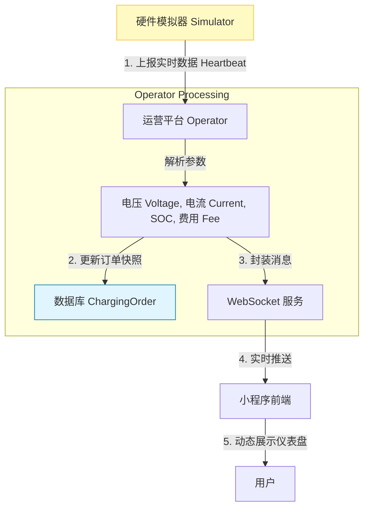
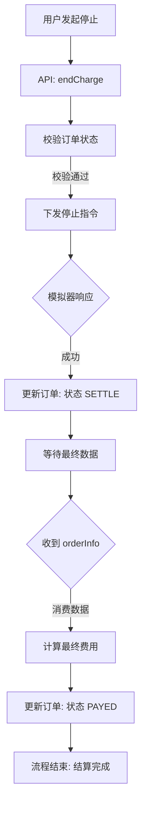
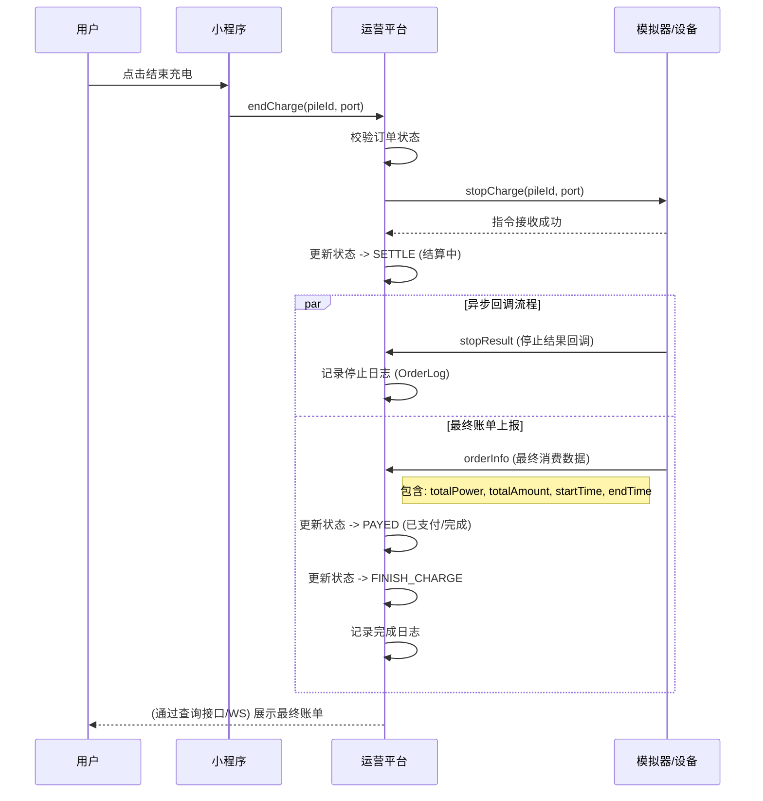
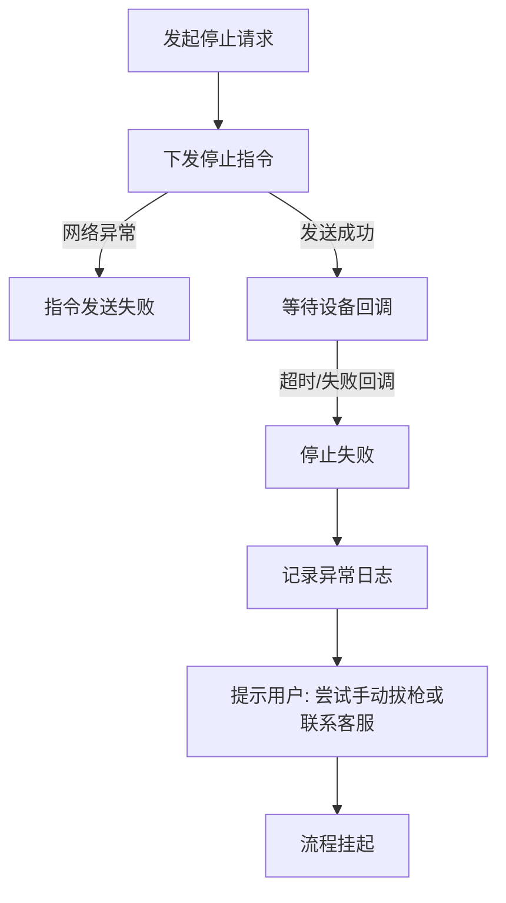

# 03-场景B-发货与售后业务 (Logistics & After-sales Scenarios)

本章节涵盖“发货配送”（充电过程监控）与“售后结算”（停止充电及订单清算）的完整闭环。

## 1. 发货/物流场景 (Logistics/Charging Scenario)

### 1.1 场景描述
在订单执行过程中，硬件设备（物流配送端）需要源源不断地将电力输送给汽车，并实时上报配送进度。运营平台需实时接收这些数据并展示给前端用户。

*   **场景目标**: 实时监控充电状态，确保数据透明。
*   **参与角色**: 充电桩 (Simulator), 运营平台 (Operator), 用户 (User).
*   **触发条件**: 充电桩每隔一定时间（如 15秒）自动上报心跳，调用 `ChargeController.chargingHeartBeat`。

### 1.2 实时监控流程 (Real-time Monitoring)

### 1.3 关键数据指标
*   `soc`: 电池剩余电量百分比 (State of Charge).
*   `chargePower`: 已充入电量 (kWh).
*   `chargeFee`: 产生的电费.
*   `serviceFee`: 产生的服务费.

---

## 2. 售后/结算场景 (After-sales/Settlement Scenario)

### 2.1 场景描述
当用户主动结束充电，或电池充满自动结束时，系统需执行“收货确认”并进行资金结算。这是一个多阶段的异步过程。

*   **场景目标**: 停止输出电流，准确核算最终费用，更新订单为完成状态。
*   **触发条件**:
    1. 用户点击“结束充电” (`OrderController.endCharge`).
    2. 或 设备检测到充满/故障自动停止.

### 2.2 正向结算流程 (Happy Path)

此流程涉及多次交互，确保计费准确。

#### 2.2.1 业务活动图 (Activity Diagram)

#### 2.2.2 系统时序图 (Sequence Diagram)

### 2.3 逆向流程 (Exception Path) - 停止失败

如果远程停止指令无法执行（如设备离线），系统需进行降级处理。

### 2.4 状态流转详解 (State Transition)

在售后结算阶段，订单状态经历关键跳变：

1.  **CHARGING (充电中)**: 初始状态。
2.  **SETTLE (结算中)**: 运营平台已发出停止指令，但尚未收到最终账单。此时订单被锁定，不能重复操作。
3.  **PAYED (已支付)**: 收到 `orderInfo` 后，平台确认消费金额，默认视为已支付（余额扣除）。
4.  **FINISH_CHARGE (充电结束)**: 物理状态结束。

### 2.5 代码映射 (Code Mapping)

| 逻辑步骤 | 代码位置 | 说明 |
| :--- | :--- | :--- |
| **实时上报** | `hcp-operator/.../ChargeController.java` | 方法 `chargingHeartBeat`。 |
| **停止入口** | `hcp-mp/.../OrderController.java` | 方法 `endCharge`。 |
| **停止逻辑** | `hcp-operator/.../ChargingOrderServiceImpl.java` | 方法 `stopChargingOrder` (状态变更为 SETTLE)。 |
| **停止结果** | `hcp-operator/.../ChargeController.java` | 方法 `stopResult`。 |
| **最终账单** | `hcp-operator/.../ChargeController.java` | 方法 `orderInfo` -> Service `handleOrderInfo` (状态变更为 PAYED)。 |
