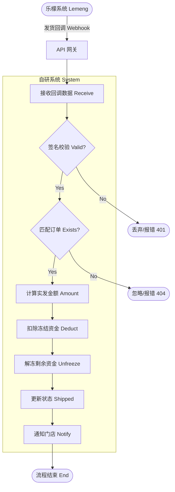
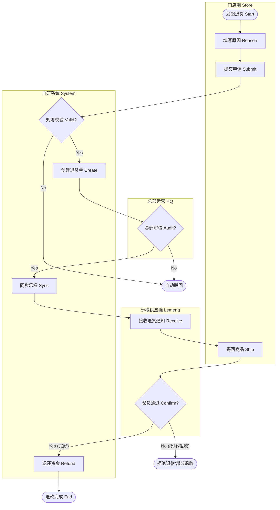
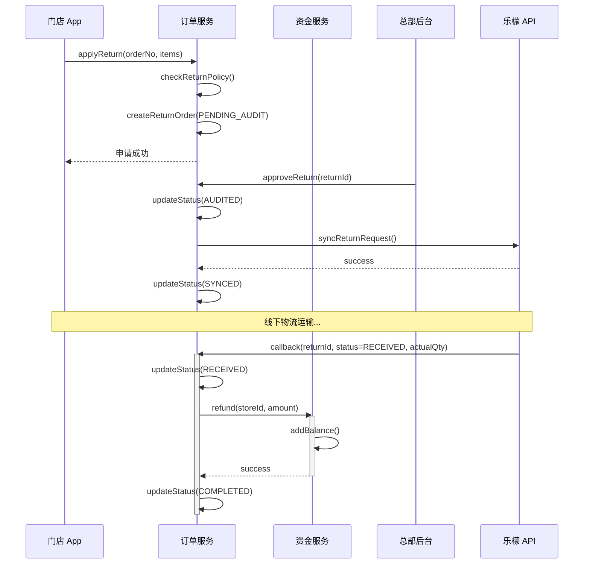

# 03. 履约与售后业务场景 (Logistics & After-sales Scenario)

> **文档受众**: 产品经理、运营人员
> **核心目标**: 阐述从供应链发货到门店收货的全过程，以及逆向退货退款的处理机制。

## 1. 场景概述 (Scenario Overview)

| 维度 | 说明 |
| :--- | :--- |
| **场景名称** | 供应链履约与售后退款 |
| **场景目标** | 确保发货状态及时同步，并根据实际发货量扣款；规范退货流程，确保资金安全退回。 |
| **参与角色** | 乐檬供应链 (Lemeng)、自研系统 (System)、门店店长 (Store Manager)、总部运营 (HQ Ops) |
| **触发条件** | **履约**: 乐檬仓库完成发货动作。 **售后**: 店长在 App 端发起退货申请。 |
| **前置条件** | **履约**: 订单已同步至乐檬。 **售后**: 订单已签收且在退货有效期内。 |

## 2. 供应链履约流程 (Fulfillment Process)

此流程由**外部系统触发**，是自研系统被动接收状态的关键环节。

### 2.1. 发货回调与扣款活动图 (Shipping Callback Activity Diagram)

**核心逻辑**:
- **按实发扣款**: 若订单订购 100 件，实际只发 80 件，则只扣除 80 件的货款，剩余 20 件的冻结金额自动解冻。
- **状态终结**: 发货是订单资金流转的终点（转为已完成/待收货）。

## 3. 售后退货流程 (After-sales Process)

此流程描述从门店发起退货到资金退回的全过程。

### 3.1. 退货逆向流程活动图 (Return Flow Activity Diagram)

**设计考量**:
- **双重审核**: 总部先审业务合理性，乐檬再审实物完好度。
- **资金兜底**: 只有乐檬确认收货入库后，财务才触发退款。

### 3.2. 退货时序图 (Return Sequence Diagram)

## 4. 状态机与数据流转

### 4.1. 退货单状态机 (Return Order State Machine)

| 状态 | 英文标识 | 含义 | 触发动作 |
| :--- | :--- | :--- | :--- |
| **待审核** | `PENDING_AUDIT` | 门店刚提交申请。 | 提交申请 |
| **已审核** | `AUDITED` | 总部运营同意退货。 | 审核通过 |
| **已驳回** | `REJECTED` | 总部或系统驳回申请。 | 审核拒绝 |
| **已同步** | `SYNCED` | 退货单已推送到乐檬，等待门店发货。 | 同步成功 |
| **已收货** | `RECEIVED` | 乐檬仓库确认收到退货。 | 收货回调 |
| **已退款** | `COMPLETED` | 资金已退回门店余额。 | 财务退款 |

## 5. 异常处理与边界

1.  **回调丢失**: 若乐檬发货回调丢失，系统需通过定时任务（每 30 分钟）主动查询乐檬订单状态接口进行补偿。
2.  **金额差异**:
    - **发货**: 冻结 100 元，实发 80 元 -> 扣 80，解冻 20。
    - **退货**: 申请退 100 元，实收 80 元（损耗） -> 退 80 元。
3.  **系统边界**:
    - **物流轨迹**: 快递单号由乐檬产生，自研系统仅透传给门店 App 展示。
    - **实物损耗**: 具体的损耗判定标准在乐檬系统维护，自研系统只接收最终“可退金额”或“可退数量”。

---
*下一篇：请阅读 `04-scenario_finance_reconciliation.md` 了解财务对账与风控逻辑。*
