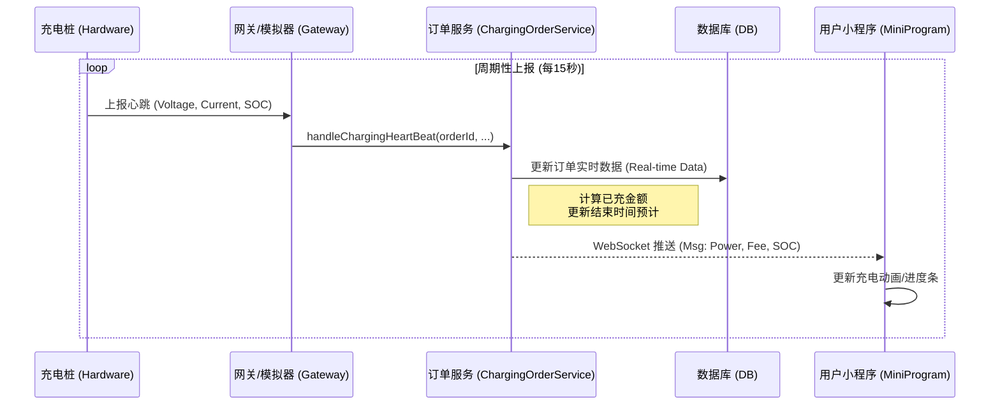
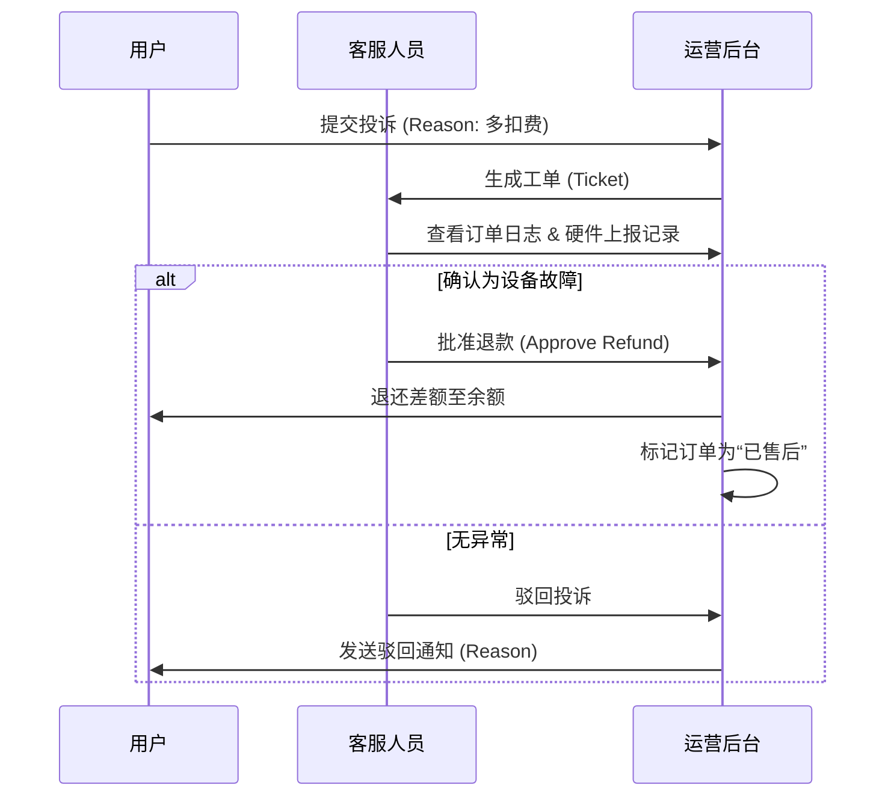

# 03-场景：物流与售后 (Logistics & After-sales)

## 1. 场景概述 (Overview)

本章节将 **充电过程中的实时监控** 类比为电商物流追踪（商品正在投递中），将 **异常停止与退款** 类比为售后服务。

### 1.1 场景目标
*   **物流追踪 (Logistics)**: 实时监控充电桩输出的电压、电流、已充金额，确保服务正常交付。
*   **售后处理 (After-sales)**: 针对充电中途意外停止（如拔枪、断电、故障）的情况，进行订单结算与自动退款。

---

## 2. 物流追踪场景：实时监控 (Service Delivery)

**核心逻辑**:
1.  充电桩周期性（例如每15秒）上报实时数据（心跳包）。
2.  系统接收数据，更新订单的“已充金额”、“已充电量”。
3.  前端（小程序）通过 WebSocket 实时展示充电进度（类似物流地图轨迹）。

#### 状态机与数据流 (Data Flow Diagram)



**关键数据字段**:
*   `voltage` (电压): 监控是否异常波动。
*   `current` (电流): 计算充电速度。
*   `soc` (电池电量百分比): 类似物流进度（0% -> 100%）。
*   `totalFee` (当前消费金额): 用户最关心的“待支付金额”。

---

## 3. 售后场景：异常停止与退款 (After-sales & Refund)

**核心逻辑**:
当充电桩检测到异常（如急停按钮按下、绝缘故障、意外拔枪）时，会主动上报停止原因码。系统需立即结算订单，确保用户不被多扣费。

### 3.1 异常停止流程 (Fault Stop)

#### 活动图 (Activity Diagram - Fault Handling)

```mermaid
activityDiagram
    start
    :充电进行中...;
    partition "智能硬件 (Hardware)" {
        :检测到异常 (如: 枪头过温 / 急停);
        :立即切断继电器 (Safety Cut-off);
        :上报停止原因 (Reason Code: 0x01 FAULT);
    }
    partition "运营平台 (Platform)" {
        :接收停止指令 (stopChargingOrder);
        :查询当前订单 (State: CHARGING);
        if (订单存在?) then (Yes)
            :读取最终电表读数;
            :计算实际消费金额;
            :结算订单 (State -> SETTLE -> PAYED);
            :记录故障原因 (Stop Reason);
        else (No)
            :记录孤儿日志 (Log Warning);
        endif

        partition "账户/售后系统" {
            if (预充值金额 > 实际消费?) then (Yes)
                :计算退款金额 = 预充 - 实消;
                :原路退回/解冻余额;
                :通知用户“充电异常结束，余额已退回”;
            else (No)
                :扣除余额;
            endif
        }
    }
    stop
```

### 3.2 投诉与人工退款 (Manual Refund)

如果用户对计费有异议（如：电表走字不准），需人工介入。

**流程**:
1.  用户在小程序点击“订单投诉”。
2.  后台客服审核投诉信息。
3.  客服调取硬件日志（`OrderLog`）核对。
4.  确认异常后，客服手动发起“余额调整”或“退款”。
5.  系统生成退款流水。



---

## 4. 系统边界与假设 (Boundaries & Assumptions)

1.  **自动退款机制**: 系统假设所有“异常停止”都视为正常结算的一种特殊情况（即：充多少算多少，剩余退回）。不存在“赔偿”逻辑（如充坏了赔钱），赔偿需线下处理。
2.  **数据准确性**: 计费完全依赖硬件上报的电表读数。如果硬件电表故障，软件端无法自纠错，只能通过人工售后解决。
3.  **退款路径**: 退款仅退回到平台余额 (`MenberBalance`)，不涉及微信/支付宝的原路退回（除非对接了支付分/信用付）。

---

## 5. 可优化点 (Optimization)

*   **智能诊断**: 系统应根据电压电流曲线自动判断是否“虚充”（有电流无电量增长），主动触发售后工单。
*   **延迟结算保护**: 针对断网情况，允许桩端存储离线数据，待网络恢复后上传并重新计算费用，避免用户“逃单”或“多扣”。
