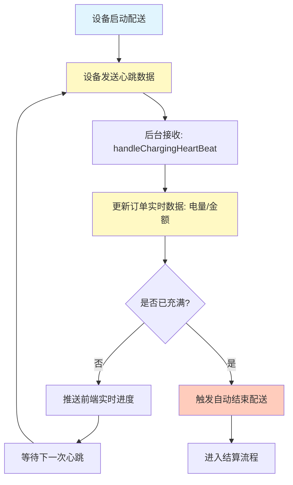
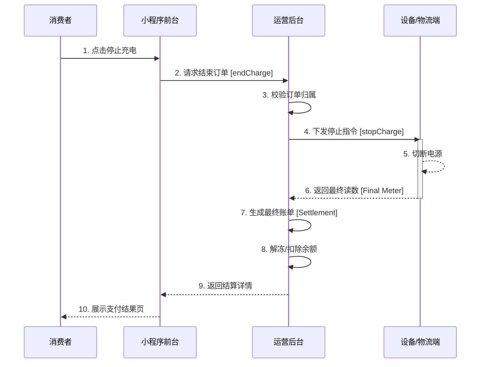

# 03-场景：物流配送与售后 (Logistics & After-sales)

本章节将**充电过程**映射为**物流配送过程**，将**停止充电与异常处理**视为**售后与退货流程**。此部分是系统最核心的实时交互环节。

## 场景一：物流配送 (充电进行中)

### 1. 场景概述
*   **场景目标**：确保电力（货物）持续、稳定地输送给用户车辆，并实时追踪配送进度。
*   **参与角色**：物流设备 (Simulator)、调度中心 (Operator)、用户端 (MP)。
*   **触发条件**：订单状态变更为“充电中” (CHARGING)。
*   **关键指标**：电流 (Current)、电压 (Voltage)、已充金额 (Amount)、SOC (电池电量)。

### 2. 正向流程：实时追踪 (Tracking)

类似于快递包裹的实时轨迹更新，充电桩会周期性上报心跳数据。

#### 业务活动图 (Activity Diagram - Tracking Loop)



### 3. 数据流转路径

1.  **设备端**：采集电压、电流、累计电量。
2.  **传输层**：通过 TCP/MQTT 协议上报至网关。
3.  **服务层**：`ChargingOrderServiceImpl` 解析数据，更新数据库。
4.  **展示层**：WebSocket 推送至小程序，用户看到电量上涨。

---

## 场景二：售后与终止 (After-sales & Termination)

### 1. 场景概述
*   **场景目标**：用户主动终止服务，或设备检测到异常自动停止，需完成订单结算并释放资源。
*   **触发条件**：用户点击“停止充电”、车辆充满、拔枪、设备故障。
*   **前置条件**：订单处于“充电中”状态。

### 2. 逆向流程：用户主动停止 (User Stop)

用户在配送中途要求退货（停止充电）。

#### 时序图 (Sequence Diagram - Stop)



### 3. 异常处理：设备故障中断 (Device Failure)

当物流车（充电桩）发生故障无法继续配送。

*   **检测机制**：心跳超时 或 设备主动上报故障码。
*   **处理逻辑**：
    1.  后台强制结束订单。
    2.  按照已充入的电量进行结算。
    3.  记录异常原因 (`stopReason`)。
    4.  通知运维人员进行设备检修。

#### 状态流转图 (State Diagram - Exception)

```mermaid
stateDiagram-v2
    [*] --> CHARGING
    CHARGING --> FAULT: 设备故障上报
    FAULT --> SETTLE: 强制结算
    SETTLE --> EXCEPTION_END: 异常结束订单
    EXCEPTION_END --> [*]

    note right of FAULT
        此时需记录故障代码
        并触发告警通知
    end
```
