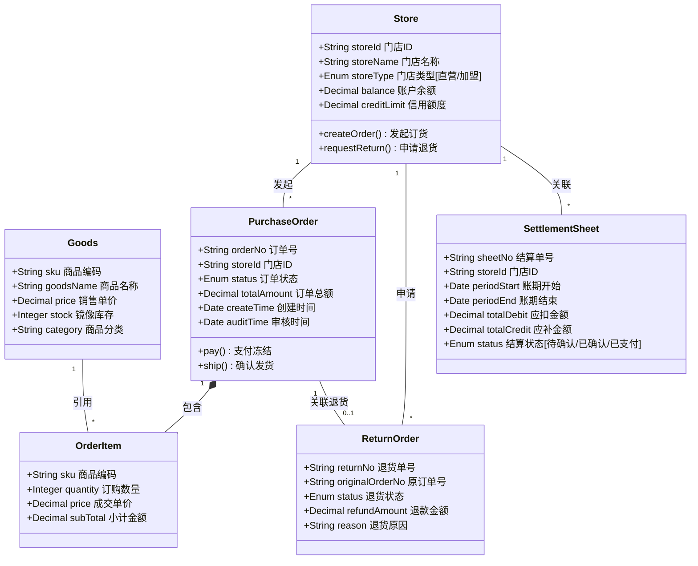

# 03. 领域数据模型 (Domain Data Model)

> **文档受众**: 架构师、开发人员
> **核心目标**: 定义核心业务实体及其属性，明确数据间的引用关系。

## 1. 核心实体类图 (Core Entity Class Diagram)

## 2. 关键字段说明

1.  **Store.storeType (门店类型)**:
    - `DIRECT`: 直营店，无需冻结资金，按月结算。
    - `FRANCHISE`: 加盟店，需预冻结资金，余额不足无法下单。

2.  **PurchaseOrder.status (订单状态)**:
    - `CREATED`: 已创建，待审核。
    - `AUDITED`: 总部已审核，待同步乐檬。
    - `SYNCED`: 已同步乐檬，待发货。
    - `SHIPPED`: 乐檬已发货 (部分/全部)。
    - `COMPLETED`: 订单完成 (已扣款)。
    - `CANCELLED`: 已取消 (解冻资金)。

3.  **SettlementSheet (结算单)**:
    - 用于周期性对账，汇总一段时间内的 `PurchaseOrder` (扣款) 和 `ReturnOrder` (退款)。
    - 对于加盟店，实时扣款为主，结算单用于核对差异。
    - 对于直营店，结算单是打款依据。
