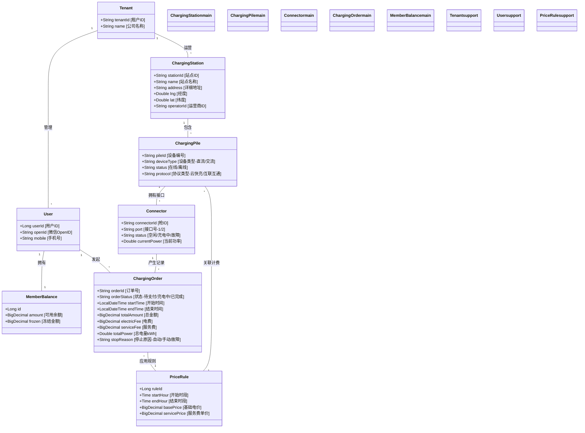

# 03. 领域模型与类图 (Domain Model & Class Diagram)

> **文档受众**: 开发人员、数据库设计人员
> **核心目标**: 清晰定义业务实体（Entities）及其关系（Relationships），并列出核心属性。

## 1. 核心实体概述 (Core Entities)

| 实体名称 | 英文标识 | 描述 | 关键属性 |
| :--- | :--- | :--- | :--- |
| **充电站** | `ChargingStation` | 物理场站，包含多个充电桩。 | 经纬度、运营商ID、费率ID |
| **充电桩** | `ChargingPile` | 具体的充电设备（如直流快充桩）。 | 桩编号、设备型号、当前状态 |
| **充电枪** | `Connector` | 物理接口，每个桩可能有双枪或单枪。 | 枪口号、实时功率、是否空闲 |
| **充电订单** | `ChargingOrder` | 一次完整的充电交易记录。 | 订单号、电量(kWh)、金额(元)、启停时间 |
| **用户账户** | `MemberBalance` | 用户资金账户。 | 余额、冻结金额、用户ID |
| **计费规则** | `PriceRule` | 时段计费策略（尖峰平谷）。 | 时段、基础电费、服务费 |

## 2. 领域模型类图 (Class Diagram)

以下图表展示了各实体间的数据关联。

## 3. 数据结构关键说明

1.  **分时计费 (Time-of-Use Pricing)**:
    - 订单在生成时，需关联当前的 `PriceRule`。
    - 若跨时段充电，系统需将订单拆分为多个时段子记录，或按分钟计算加权平均价（具体视业务逻辑而定，通常拆分计算最准）。

2.  **资金安全 (Fund Security)**:
    - `MemberBalance` 表设计需考虑并发扣款，建议使用 `乐观锁 (version)` 或数据库行锁。
    - 每次扣款前必须进行 `Check Balance` 校验。

3.  **状态同步**:
    - `Connector.status` 必须与 `ChargingPile` 上报的实时状态保持最终一致。
    - `ChargingOrder.orderStatus` 需根据设备网关的回调严格流转。
