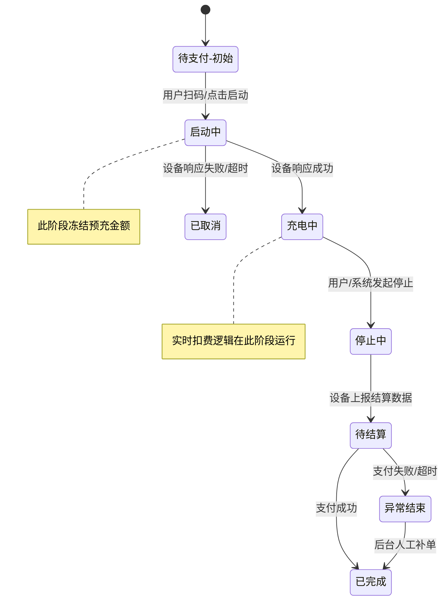
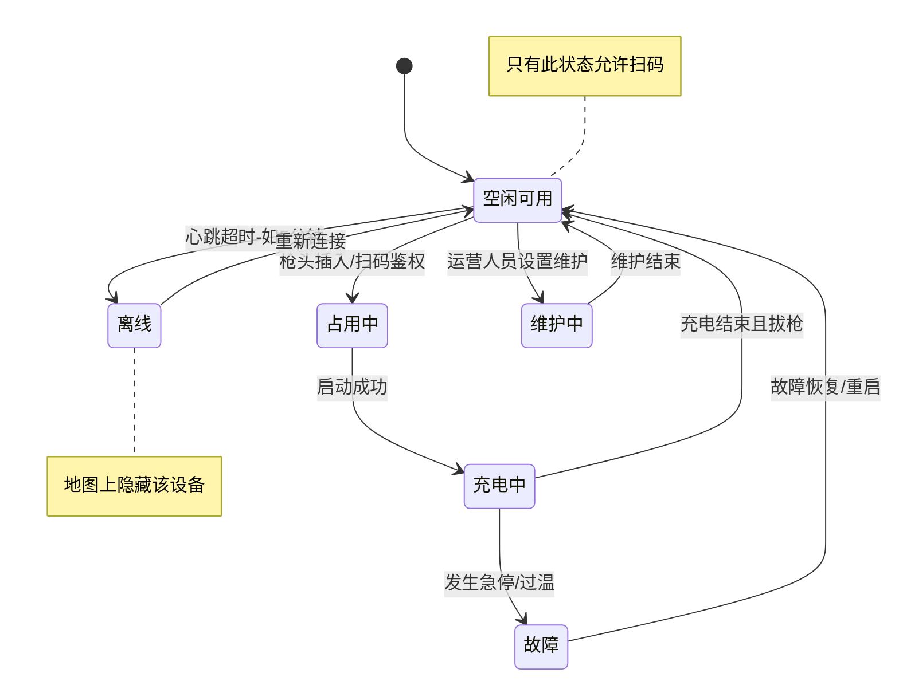

# 状态机设计 (State Machine Design)

本文档详细描述系统中最核心的两个实体——**充电订单**与**充电桩设备**的状态流转逻辑。理解状态机有助于明确“在什么情况下允许做什么操作”。

## 1. 充电订单状态机 (Order State Machine)

订单是连接用户、资金与业务的核心凭证。其生命周期管理必须严谨，以防资金损失。

### 状态解释 (State Definitions)

| 状态 | 含义 | 允许操作 |
| :--- | :--- | :--- |
| **待支付/初始** | 用户已扫码，尚未发送启动指令 | 取消订单、修改预充金额 |
| **启动中** | 平台已下发指令，等待设备ACK | 禁止操作，等待超时(如60s) |
| **充电中** | 设备已开始输出电流 | 停止充电、查看进度 |
| **停止中** | 正在等待设备切断电源并上传账单 | 禁止操作 |
| **待结算** | 充电结束，生成账单，等待扣款 | 发起支付、申请退款 |
| **已完成** | 支付成功，流程闭环 | 申请开票、查看详情 |
| **已取消** | 启动失败或用户主动撤单 | 无 |

## 2. 充电桩设备状态机 (Device State Machine)

设备状态决定了用户能否扫码成功，直接影响用户体验。

### 状态流转规则 (Transition Rules)

1.  **心跳检测 (Heartbeat Check)**：
    -   平台定期（如30秒）接收设备心跳。若连续3次（即90秒）未收到，强制将状态置为**离线 (Offline)**。
    -   设备重新上报心跳后，立即恢复为**空闲 (Idle)** 或 **充电中 (Charging)**（视具体报文内容而定）。

2.  **故障上报 (Fault Report)**：
    -   设备检测到急停按钮按下、过压、欠压、过温等硬件故障时，主动上报错误码。
    -   平台接收到错误码后，将状态置为**故障 (Fault)** 并生成工单通知运维人员。

3.  **占用逻辑 (Occupancy)**：
    -   当用户扫码成功但未启动充电时，枪头处于“预占用”状态，避免其他用户重复扫码。
    -   若N分钟内未启动，自动释放为**空闲**。
