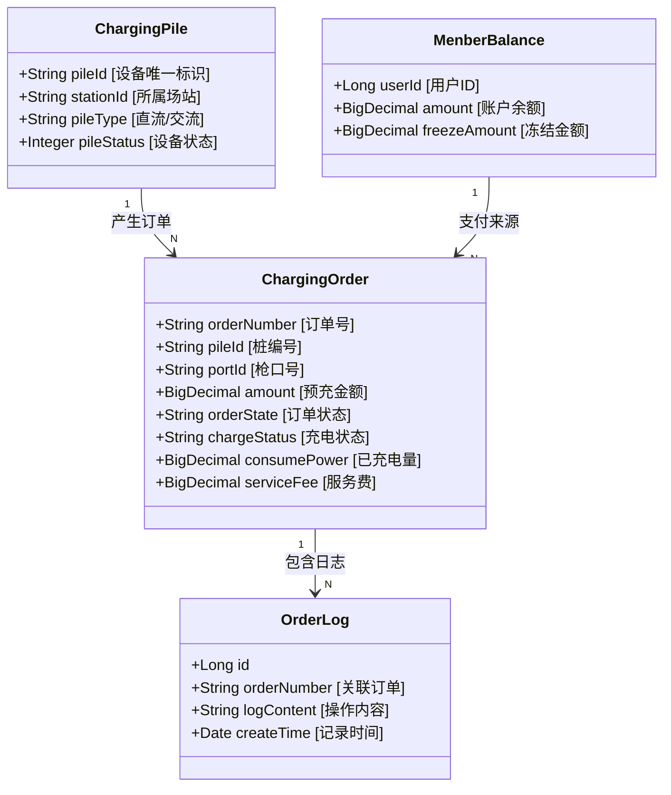

# 04-数据模型与状态流转 (Data Model & State Transition)

本章节将详细剖析系统的核心**数据结构**与**状态机**。这是业务逻辑运转的骨架。

## 1. 核心业务对象 (Class Diagram)

我们使用 UML 类图来展示各实体之间的关系。

### 核心类图



## 2. 订单全生命周期状态机 (Order Lifecycle)

订单状态 (`orderState`) 是系统流转的核心驱动力。

### 状态定义表

| 状态码 | 业务含义 | 触发动作 |
| :--- | :--- | :--- |
| **PLACE** | 已下单/待启动 | 用户点击开始充电 |
| **CHARGING** | 充电进行中 | 设备响应启动成功 |
| **SETTLE** | 结算中 | 用户或设备停止充电 |
| **PAYED** | 已支付/完成 | 扣款成功 |
| **EXCEPTION** | 异常结束 | 设备故障或扣款失败 |

### 状态流转图 (State Machine Diagram)

```mermaid
stateDiagram-v2
    [*] --> PLACE: 下单成功

    PLACE --> CHARGING: 设备启动响应 (ACK)
    PLACE --> EXCEPTION: 设备启动超时/失败

    CHARGING --> SETTLE: 用户停止/充满自停
    CHARGING --> EXCEPTION: 运行中故障

    SETTLE --> PAYED: 余额扣款成功
    SETTLE --> EXCEPTION: 余额不足/扣款异常

    PAYED --> [*]: 订单归档
    EXCEPTION --> [*]: 需人工介入

    note right of PLACE
        此时预冻结金额
        若失败则解冻
    end

    note right of CHARGING
        持续接收心跳
        更新电量读数
    end
```

## 3. 关键字段说明

### 3.1 费用计算模型
*   **基础电费** = `consumePower` * `electricityPrice` (分时电价)
*   **服务费** = `consumePower` * `servicePrice` (运营商设定)
*   **总费用** = 基础电费 + 服务费

### 3.2 异常记录
*   `stopReason`: 记录停止原因（用户主动、充满自停、急停按钮按下、欠压故障等）。
*   `failReason`: 启动失败的具体原因。
