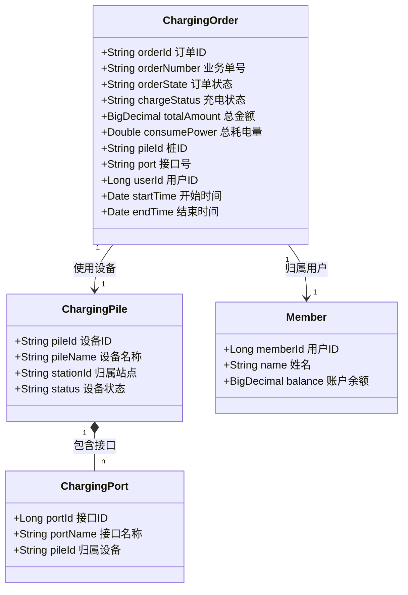
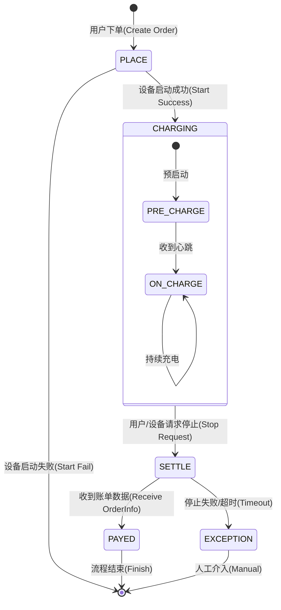

# 04-数据模型与状态流转 (Data Model & State Machine)

本章节从静态数据结构和动态状态变化两个维度，深入剖析系统的核心设计。

## 1. 核心实体类图 (Core Class Diagram)

以下类图展示了系统中关键业务对象及其属性关系。

## 2. 订单状态机 (Order State Machine)

订单状态流转是业务逻辑的核心驱动力。本系统使用了两个维度的状态字段：`orderState` (订单生命周期) 和 `chargeStatus` (物理充电过程)。

### 2.1 状态枚举定义

*   **PLACE (已下单)**: 订单刚创建，等待设备响应。
*   **CHARGING (充电中)**: 设备已启动，正在计费。
*   **SETTLE (结算中)**: 充电结束，等待最终账单数据。
*   **PAYED (已支付/完成)**: 订单完结，款项已扣除。

### 2.2 完整状态流转图

### 2.3 关键状态流转说明

1.  **下单 -> 充电中**:
    *   这是一个跨系统异步过程。DB 先生成 `PLACE` 状态订单，待收到模拟器 `startResult` 回调为成功时，变更为 `CHARGING`。如果回调失败，订单逻辑上应标记为“启动失败”并终结。

2.  **充电中 -> 结算中**:
    *   当调用 `stopChargingOrder` 时，状态立即更新为 `SETTLE`。此时不仅是为了显示给用户，更是为了**锁定订单**，防止重复的停止指令导致数据错乱。

3.  **结算中 -> 已支付**:
    *   系统完全信任设备（模拟器）上报的最终消费数据 `orderInfo`。一旦收到该数据，立即计算费用并标记为 `PAYED`。

## 3. 数据一致性设计 (Data Consistency)

*   **最终一致性**: 订单的最终金额依赖于设备的 `orderInfo` 上报。
*   **冗余设计**: 订单表中冗余了 `pileId`, `port`, `userId`，即使设备或用户被删除，历史订单数据依然完整。
*   **日志留痕**: 关键状态变更（创建、启动、停止、完成）都会在 `OrderLog` 表中插入一条记录，用于后续审计和问题排查。
