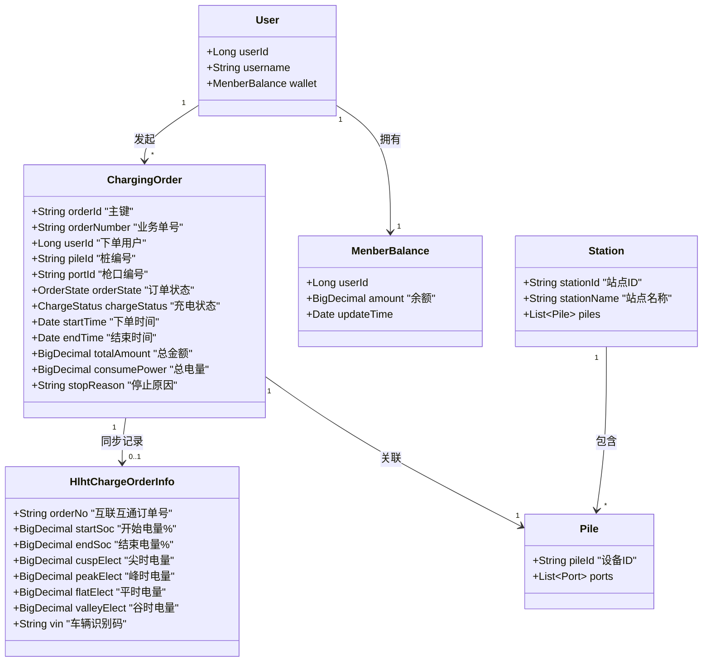
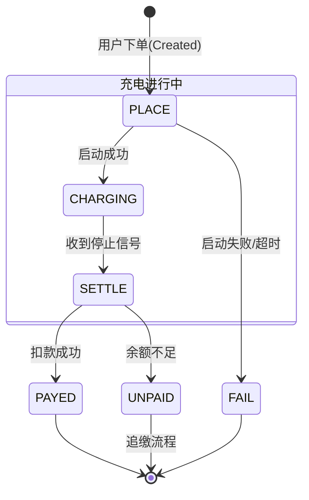
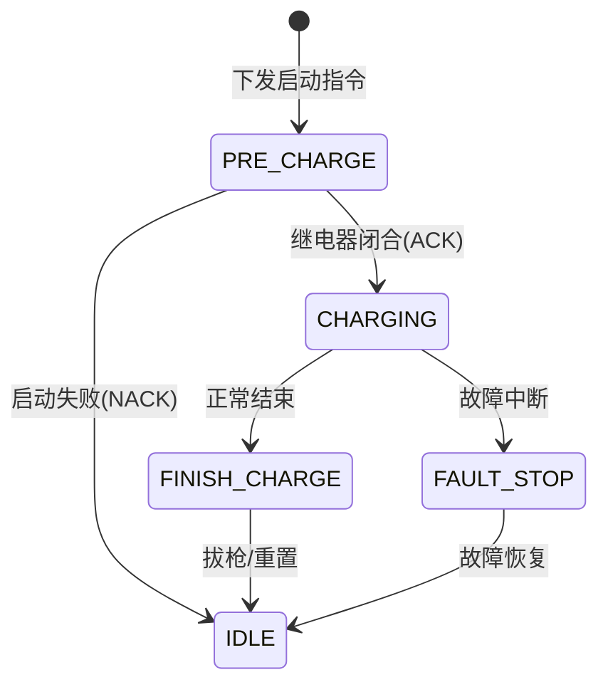

# 04-场景：数据模型与状态流转 (Data Model & State Transition)

## 1. 核心数据模型 (Core Data Model)

本章节定义了业务的核心实体及其关系。

### 1.1 类图 (Class Diagram)



### 1.2 关键字段解释 (Field Explanation)

*   **`OrderState` (订单状态)**: 描述整个交易的生命周期（下单 -> 支付 -> 完成）。
*   **`ChargeStatus` (充电状态)**: 描述物理设备的运行状态（准备 -> 充电中 -> 已停止）。
*   **`soc` (State of Charge)**: 电池剩余电量百分比。`startSoc` 和 `endSoc` 的差值反映了充电效果。
*   **分时电量 (`cusp`, `peak`, `flat`, `valley`)**: 根据不同时间段统计的电量。不同时间段电价不同（尖峰平谷），系统需分别计算费用后求和。
*   **`stopReason`**: 停止原因码（如：用户手动停止、充满自停、设备故障、欠费停止）。

---

## 2. 状态流转机 (State Machine)

### 2.1 订单状态流转 (Order Lifecycle)



### 2.2 充电物理状态流转 (Physical Charge Status)



---

## 3. 数据流转全景 (End-to-End Data Flow)

从用户下单到最终生成报表的数据流向：

```mermaid
graph LR
    User[用户操作] -->|创建订单| OrderDB[(订单库)]
    OrderDB -->|指令| Hardware[硬件设备]

    Hardware -->|实时数据| Cache[(Redis缓存)]
    Cache -->|WebSocket| User

    Hardware -->|结束结算| OrderDB
    OrderDB -->|扣费| WalletDB[(余额库)]

    OrderDB -->|归档| ReportDB[(报表/大数据)]
    OrderDB -->|同步| GovPlatform[政府监管平台(互联互通)]
```

## 4. 特殊业务逻辑说明 (Business Rules)

1.  **分时计费逻辑**:
    *   费用 = `尖时电量 * 尖时电价` + `峰时电量 * 峰时电价` + ... + `服务费`。
    *   如果一次充电跨越多个时段（例如从平段充到峰段），系统需将电量按时间段拆分计算。
2.  **精度处理**:
    *   金额保留 2 位小数（`BigDecimal`），采用“四舍五入”或“截断”策略（具体看配置）。
    *   电量通常保留 2-3 位小数。
