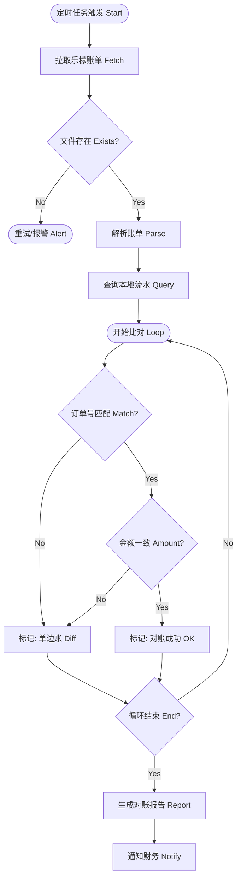
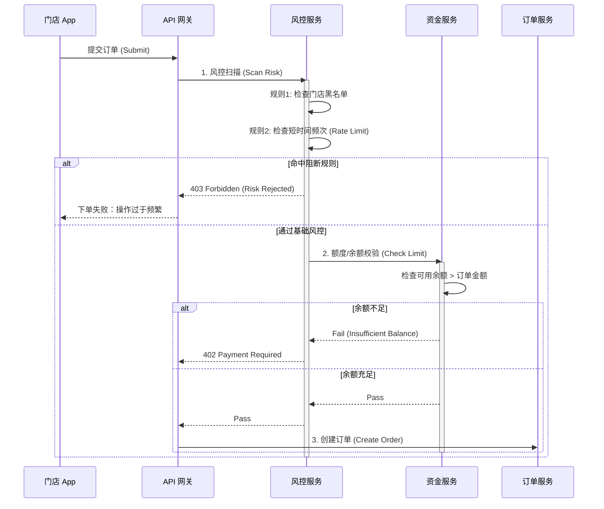

# 04. 财务对账与风控业务场景 (Finance & Reconciliation Scenario)

> **文档受众**: 财务人员、审计人员、系统管理员
> **核心目标**: 确保账实相符，通过 T+1 对账机制发现异常，并利用风控规则拦截潜在风险。

## 1. 场景概述 (Scenario Overview)

| 维度 | 说明 |
| :--- | :--- |
| **场景名称** | 每日资金对账与风控 |
| **场景目标** | 发现并修正自研系统与供应链系统之间的资金/库存差异；拦截恶意刷单或超额透支行为。 |
| **参与角色** | 总部财务 (HQ Finance)、系统自动任务 (Scheduler)、乐檬对账接口 (Lemeng Bill API) |
| **触发条件** | **对账**: 每日凌晨 02:00 定时触发。 **风控**: 每笔订单提交时实时触发。 |
| **关键指标** | 账目差异率 < 0.01%，风控误判率 < 0.1%。 |

## 2. 每日对账流程 (Daily Reconciliation Process)

### 2.1. T+1 对账活动图 (Reconciliation Activity Diagram)

此流程描述系统自动拉取乐檬账单并与本地流水进行比对的过程。

**设计原则**:
- **以供应链为准**: 乐檬发货单是最终的结算依据。
- **差异挂起**: 自动对账无法解决的差异，生成“差异单”转人工处理，不阻塞系统运行。

### 2.2. 差异处理机制 (Dispute Resolution)

| 差异类型 | 原因分析 | 处理建议 |
| :--- | :--- | :--- |
| **乐檬有，本地无** | 门店在乐檬系统直接下单（绕过自研系统），或数据丢失。 | 手动补单或确认是否违规操作。 |
| **本地有，乐檬无** | 订单未同步成功，或乐檬漏单。 | 检查同步日志，若已发货则联系乐檬补数据；若未发货则关闭本地订单。 |
| **金额不一致** | 改价、部分发货计算逻辑差异、运费计算差异。 | 以乐檬金额为准进行“调账”（生成调整单）。 |

## 3. 风控拦截场景 (Risk Control Scenario)

### 3.1. 实时风控时序图 (Risk Check Sequence Diagram)

在订单创建前置环节进行拦截，保护资金安全。

## 4. 核心风控规则库 (Risk Rules)

| 规则ID | 规则名称 | 阈值设定 | 处置动作 | 适用对象 |
| :--- | :--- | :--- | :--- | :--- |
| **R001** | **余额透支拦截** | 可用余额 < 0 | 阻断下单 | 加盟店 |
| **R002** | **信用额度超限** | 未结账单 > 信用额度 | 阻断下单 | 直营店 |
| **R003** | **高频下单限制** | 单门店 1分钟内 > 5单 | 阻断下单 | 所有门店 |
| **R004** | **异常大额订单** | 单笔金额 > 50,000元 | 转人工审核 | 所有门店 |
| **R005** | **重复下单拦截** | 相同SKU+数量在 5秒内提交 | 阻断并提示 | 所有门店 |

## 5. 数据模型支持

### 对账单实体 (ReconciliationSheet)
- `batchNo`: 批次号（日期）
- `totalOrders`: 总订单数
- `matchCount`: 匹配成功数
- `diffCount`: 差异数
- `status`: [INIT, PROCESSING, COMPLETED, HAS_DIFF]

### 差异明细 (DiffDetail)
- `orderNo`: 关联订单号
- `localAmount`: 本地金额
- `remoteAmount`: 乐檬金额
- `diffType`: [LOCAL_MISSING, REMOTE_MISSING, AMOUNT_MISMATCH]
- `handleStatus`: [PENDING, RESOLVED]

---
*下一篇：请阅读 `05-data_model_and_state.md` 了解核心领域模型设计。*
