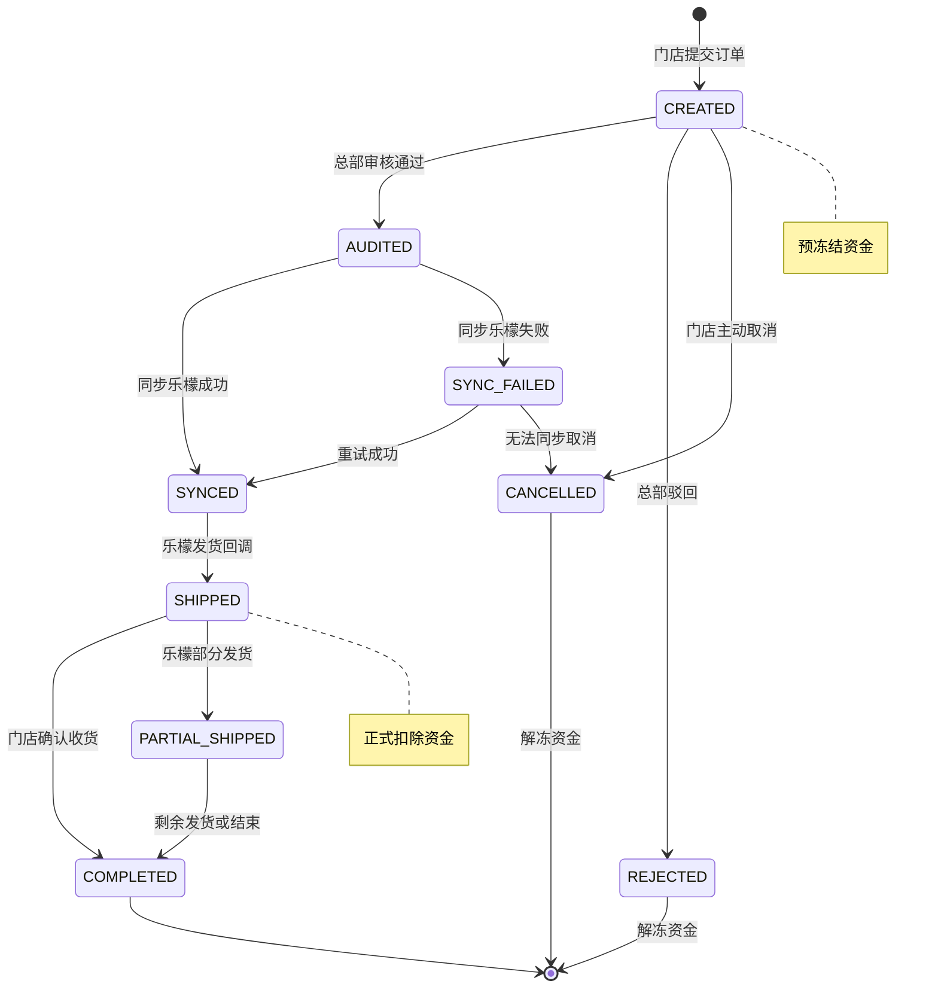
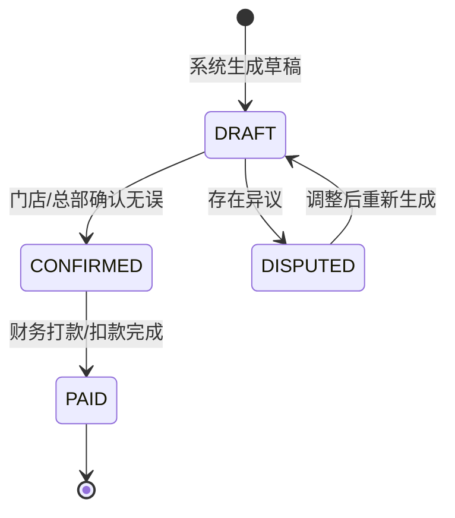

# 04. 核心单据状态机 (Core State Machines)

> **文档受众**: 研发人员、测试人员
> **核心目标**: 明确核心单据的全生命周期状态流转及触发条件。

## 1. 订货单状态机 (Purchase Order State Machine)

描述订货单从创建到最终完成的流转过程。

## 2. 资金结算单状态机 (Settlement Sheet State Machine)

描述周期性结算单的状态流转。

## 3. 状态变更说明

| 状态 | 说明 | 触发动作 | 资金影响 |
| :--- | :--- | :--- | :--- |
| **CREATED** | 已创建 | 门店下单 | 冻结 `订单总额` |
| **AUDITED** | 已审核 | 总部运营审核 | 无 |
| **SYNCED** | 已同步 | 系统推送到乐檬 API | 无 |
| **SHIPPED** | 已发货 | 乐檬回调发货信息 | 解冻原金额，扣除 `实际发货金额` |
| **COMPLETED** | 已完成 | 门店收货确认 | 无 |
| **REJECTED** | 已驳回 | 总部审核不通过 | 全额解冻 |
| **CANCELLED** | 已取消 | 门店取消或同步失败 | 全额解冻 |
