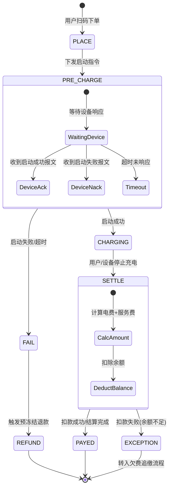
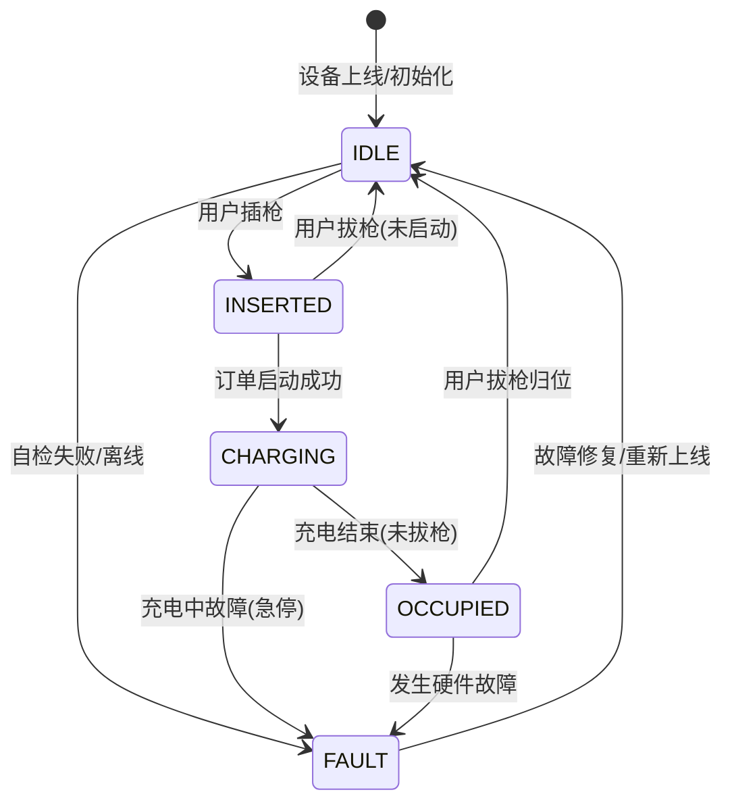

# 04. 核心单据状态机 (Core State Machines)

> **文档受众**: 测试人员、后端开发
> **核心目标**: 明确核心业务单据（订单、设备）的状态流转逻辑及触发条件，特别是异常分支。

## 1. 充电订单状态机 (Order State Machine)

订单是整个充电交易的核心载体，其状态必须与设备物理状态保持强一致。

### 1.1 状态枚举 (States)

| 状态码 | 英文标识 | 描述 |
| :--- | :--- | :--- |
| **0** | `PLACE` | 预下单/创建中。 |
| **1** | `PRE_CHARGE` | 启动指令已下发，等待设备响应。 |
| **2** | `CHARGING` | 充电进行中，收到设备心跳。 |
| **3** | `SETTLE` | 充电结束，正在计算费用。 |
| **4** | `PAYED` | 费用已结清，订单完成。 |
| **-1** | `FAIL` | 启动失败或设备故障。 |
| **-2** | `CANCEL` | 用户主动取消（未启动前）。 |

### 1.2 状态流转图 (State Diagram)

## 2. 充电枪状态机 (Connector/Gun State Machine)

设备物理状态决定了是否可以创建新订单。

### 2.1 状态枚举 (States)

| 状态码 | 英文标识 | 描述 |
| :--- | :--- | :--- |
| **0** | `IDLE` | 空闲，可使用。 |
| **1** | `INSERTED` | 枪头已插入车辆，未启动。 |
| **2** | `CHARGING` | 正在充电。 |
| **3** | `FAULT` | 设备故障/离线。 |
| **4** | `OCCUPIED` | 占用中（如充电结束未拔枪）。 |

### 2.2 状态流转图 (State Diagram)

## 3. 并发与一致性保障

1.  **状态防重**: 订单状态流转必须单向不可逆（除特殊回滚流程）。例如，一旦进入 `PAYED`，绝不可再回到 `CHARGING`。
2.  **分布式锁**: 在 `SETTLE` 阶段，建议对 `OrderId` 加锁，防止重复结算（如设备重发结束报文）。
3.  **最终一致性**: 若设备突然离线导致订单卡在 `CHARGING`，需有定时任务（Job）扫描长时间无心跳的订单，主动触发 `Status Check` 或强制结算。
