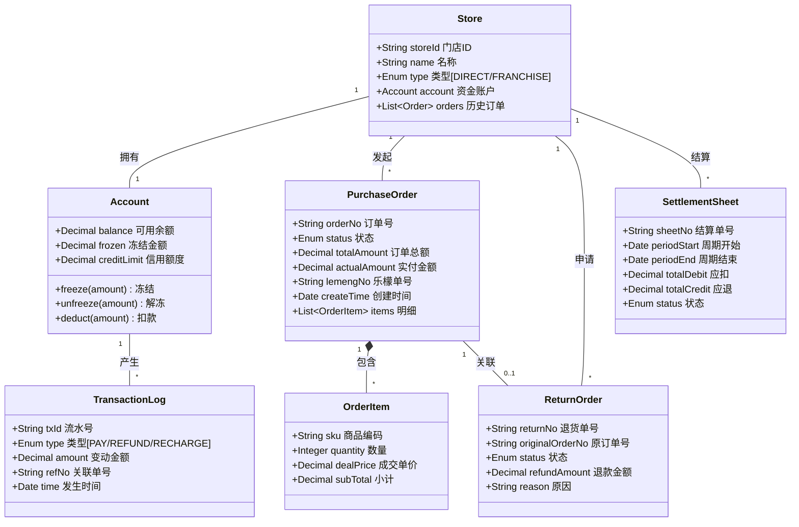
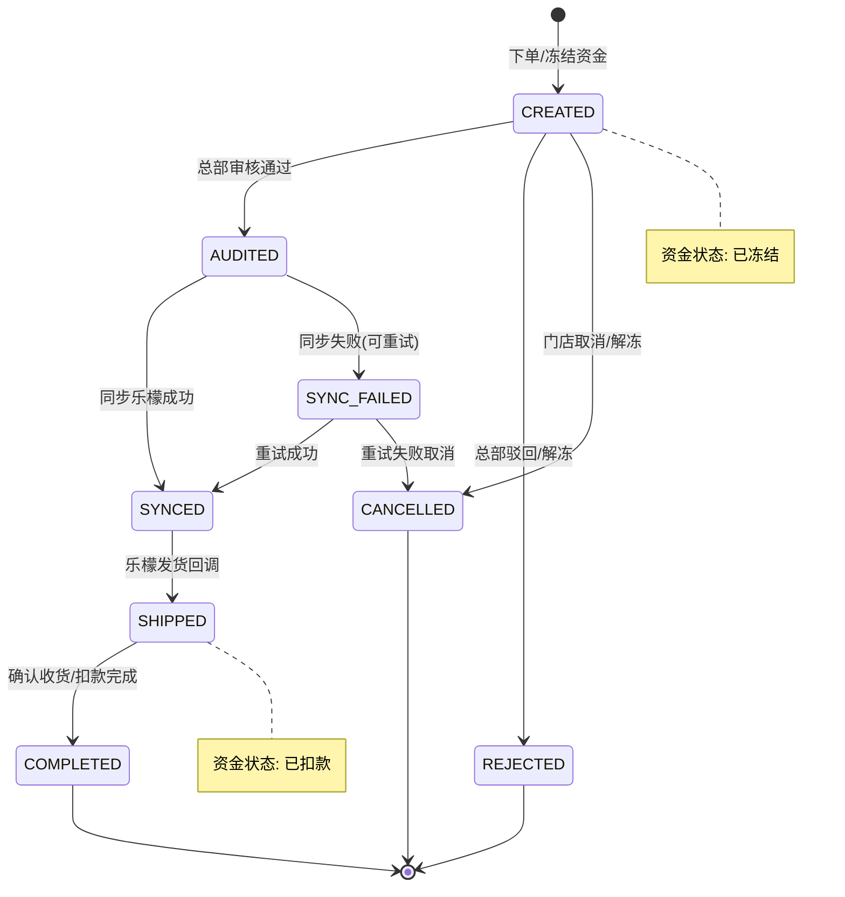
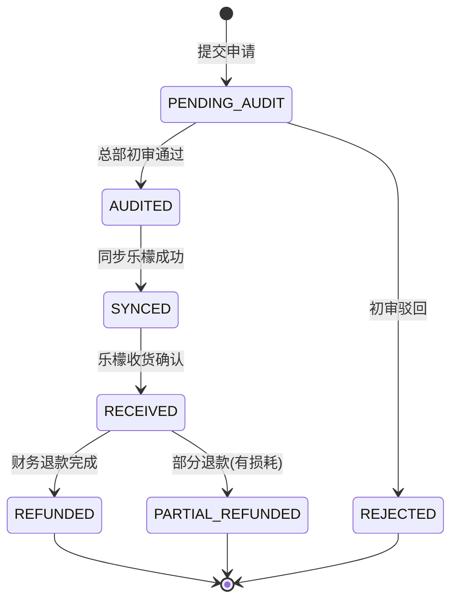
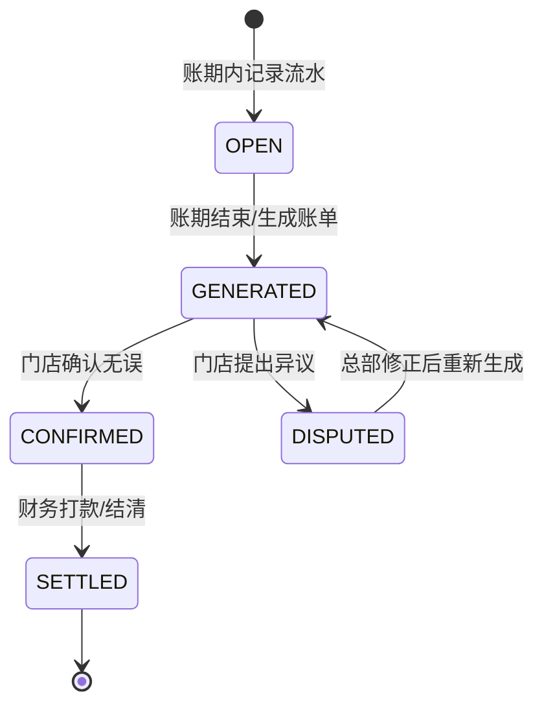

# 05. 核心数据模型与状态流转 (Data Model & State Transition)

> **文档受众**: 架构师、资深开发人员
> **核心目标**: 规范系统的静态数据结构（类图）与动态行为逻辑（状态机），确保业务概念的一致性。

## 1. 领域模型类图 (Domain Class Diagram)

本图展示了核心业务实体及其关联关系。

**设计亮点**:
- **账单分离**: `SettlementSheet` 独立于订单存在，支持按周期汇总多个订单。
- **动账流水**: `TransactionLog` 记录每一笔资金变动，确保财务可追溯。
- **快照机制**: `OrderItem` 冗余存储下单时的价格 (`dealPrice`)，防止商品改价影响历史订单。

## 2. 核心状态机 (Core State Machines)

状态机定义了单据生命周期的合法流转路径，严禁非法跳变。

### 2.1. 订货单状态机 (Order State Machine)

### 2.2. 退货单状态机 (Return State Machine)

### 2.3. 结算单状态机 (Settlement State Machine)

## 3. 关键业务规则 (Business Rules)

1.  **不可逆规则**: 订单一旦进入 `SHIPPED`（发货）状态，不可再直接取消，必须走 `ReturnOrder`（退货）流程。
2.  **资金强一致**:
    - `Account.balance`（余额） + `Account.frozen`（冻结） = 总资产。
    - 任何 `frozen` 的增加必须对应一笔 `PurchaseOrder`。
    - 任何 `frozen` 的减少必须对应 `PurchaseOrder` 的完成（扣款）或取消（解冻）。
3.  **幂等性**: 所有涉及资金变动的接口（扣款、退款）必须支持幂等调用，防止网络重试导致重复扣款。

---
*下一篇：请阅读 `06-exception_compensation.md` 了解异常处理与补偿机制。*
