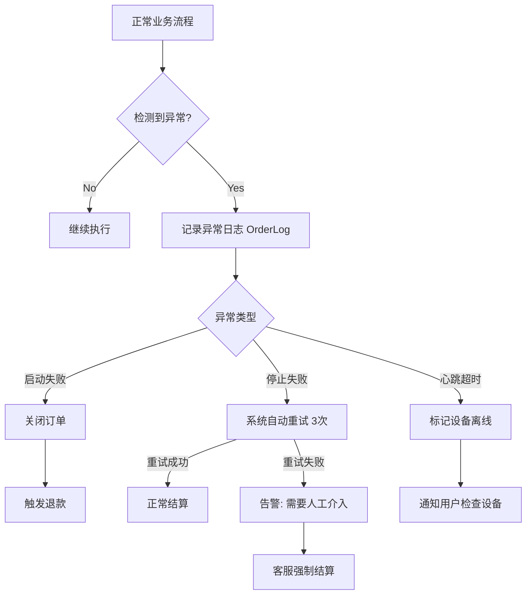

# 05-异常与补偿机制 (Exception Handling & Compensation)

在分布式物联网系统中，设备离线、网络抖动、硬件故障是常态。本章节分析当前的异常处理逻辑及改进建议。

## 1. 核心异常场景分析

### 1.1 启动失败 (Start Failure)
当用户扫码下单后，指令下发给设备，但设备反馈无法启动（例如：枪头未插好、急停按钮按下）。

*   **当前处理**:
    *   `ChargeController.startResult` 接收失败回调。
    *   `ChargingOrderService` 记录失败原因到日志。
    *   **问题**: 订单状态可能卡在 `PLACE` 或 `PRE_CHARGE`，未明确变更为“关闭/失败”。
*   **补偿建议**:
    *   收到失败回调后，立即将订单状态更新为 `CLOSED`。
    *   若涉及预扣款，需触发自动退款流程。

### 1.2 停止失败 (Stop Failure)
用户点击停止充电，但设备无响应或返回停止失败。

*   **当前处理**:
    *   `stopChargingOrder` 先将状态设为 `SETTLE`。
    *   `stopResult` 记录失败日志。
    *   **问题**: 订单卡在 `SETTLE` 状态，用户无法进行下一次充电，且计费可能仍在继续。
*   **补偿建议**:
    *   **重试机制**: 系统自动重发 3 次停止指令。
    *   **强制结算**: 允许管理员或客服在后台“强制结束订单”，以最后一次心跳数据结算。

### 1.3 心跳超时 (Heartbeat Timeout)
设备在充电过程中突然断网，不再上报心跳。

*   **当前处理**: 无明确超时检测逻辑。
*   **潜在风险**: 用户以为还在充电，实际可能已停止；或设备仍在充电但平台无法计费。
*   **补偿建议**:
    *   引入 `Timeout Monitor`，若超过 3 分钟无心跳，标记设备为离线，并给用户推送告警。

## 2. 异常处理流程图 (Exception Flow)

## 3. 对账与资金安全 (Reconciliation)

虽代码未完全体现，但在商业闭环中，对账是最后一道防线。

*   **长款 (Long)**: 平台有订单，支付网关无流水（少见）。
*   **短款 (Short)**: 平台显示未支付，但用户实际已扣款。
    *   **处理**: 每日凌晨拉取微信/支付宝对账单，比对系统内 `PAYED` 订单。发现差异自动生成“差错账单”供财务审核。

## 4. 总结与建议

当前系统的异常处理主要依赖**日志记录**，缺乏自动化的**状态回滚**与**补偿机制**。建议在下一阶段重点开发“异常订单自动巡检任务” (Scheduled Task)，定期扫描卡在中间状态（如 `PRE_CHARGE`, `SETTLE`）超过一定时间的订单并自动修复。
