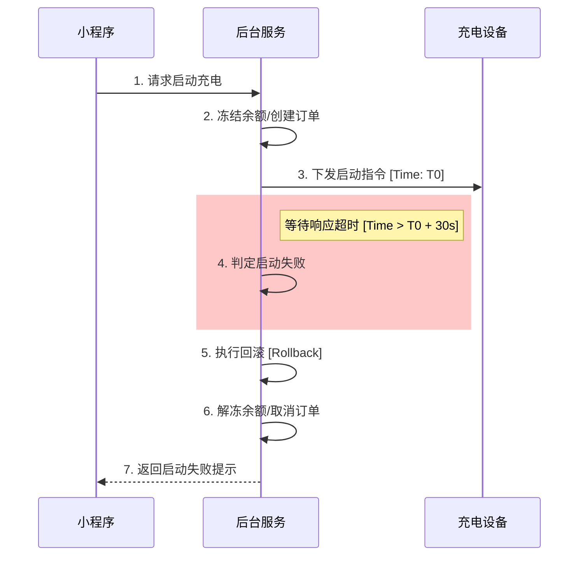
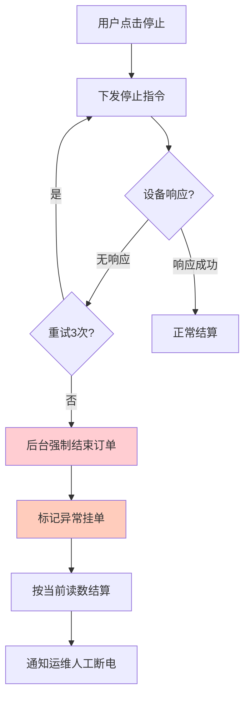

# 05-异常处理与对账补偿 (Exception & Reconciliation)

本章节涵盖**系统健壮性设计**，重点分析“如果出错了怎么办”。这是任何商业系统（尤其是涉及资金和硬件的系统）的生命线。

## 场景一：启动失败的补偿流程 (Start Failure)

### 1. 场景描述
用户点击启动，钱已冻结，但设备因网络波动或硬件故障未启动成功。

### 2. 补偿逻辑 (Sequence Diagram)

### 3. 处理策略
*   **超时机制**：设置30-60秒的指令等待时间。
*   **自动退款**：一旦判定失败，必须原子性地执行余额解冻。
*   **错误码透传**：将设备返回的错误码（如“急停被按下”）清晰展示给用户。

---

## 场景二：停止失败与挂单处理 (Stop Failure)

### 1. 场景描述
用户点击停止，但设备没反应，依然在通电计费。这是最严重的客诉场景。

### 2. 强制结算逻辑 (Force Stop)

---

## 场景三：资金对账 (Reconciliation)

### 1. 对账目标
确保“用户支付的钱”等于“设备实际输出电量的应收费用”。

### 2. 对账流程
系统每日凌晨（T+1）自动执行对账任务。

*   **数据源A**：`ChargingOrder` 表中的 `amount` (实收金额)。
*   **数据源B**：`MenberBalance` 表中的流水变动。
*   **数据源C**：设备上报的最终电表读数 (Meter Value)。

### 3. 差异处理
*   **长款 (多收)**：系统自动发起退款流程，退回用户余额。
*   **短款 (少收)**：标记坏账，记录用户信用分，下次充电前补缴。
