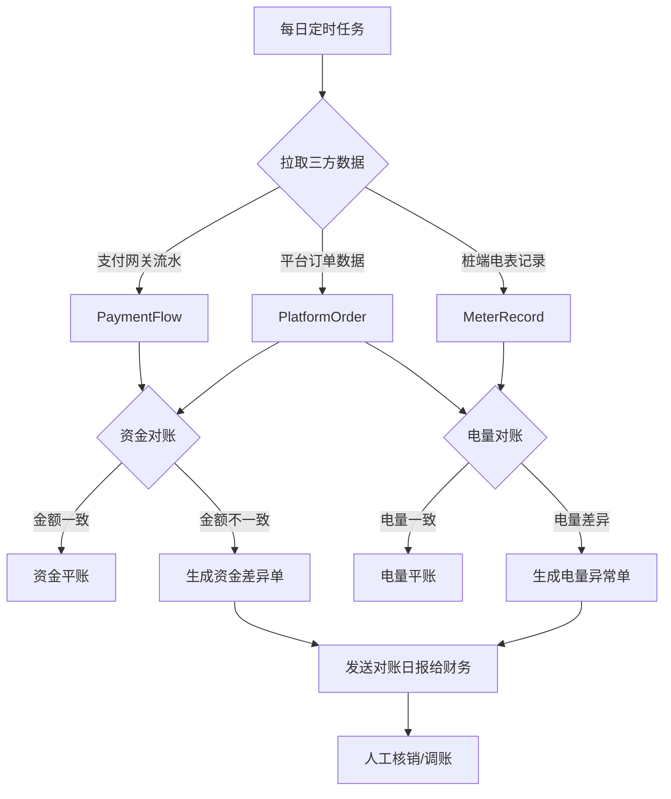

# 05-场景：异常补偿与对账 (Exception Handling & Reconciliation)

## 1. 场景概述 (Overview)

本章节涵盖业务中的“非理想状态”处理逻辑，以及每日的财务核对流程。

### 1.1 场景目标
*   **异常拦截 (Exception Interception)**: 识别并妥善处理设备离线、余额不足、启动失败等异常。
*   **补偿机制 (Compensation)**: 对由于系统或网络原因导致的错扣费、多扣费进行自动或手动补偿。
*   **对账 (Reconciliation)**: 每日核对“业务订单”与“资金流水”，确保账实相符。

---

## 2. 核心异常场景处理 (Key Exception Handling)

### 2.1 启动失败 (Start Fail)

如果用户扫码启动后，桩端因通讯故障或设备故障未能响应启动成功信号。

**处理流程**:
1.  用户下单，订单状态 `PLACE`。
2.  下发指令。
3.  设定超时定时器（例如 60秒）。
4.  **超时处理**:
    *   若超时未收到 ACK，自动取消订单 (Status -> `FAIL`).
    *   若已冻结预付款，发起全额解冻退款。
    *   向用户推送“启动超时，请重试”消息。

### 2.2 中途断网 (Network Interruption)

充电过程中，桩端断网，此时用户在手机点击“停止充电”无效。

**处理流程**:
1.  **容灾策略**: 桩端具备离线存储能力。即使断网，也会持续充电直到满电或达到最大金额限制。
2.  **离线结算**: 网络恢复后，桩端补传停止记录和最终电量。
3.  **后端补偿**:
    *   后端接收到补传数据。
    *   根据补传的“实际停止时间”重新计算分时电费（而非当前时间）。
    *   更新订单状态为 `PAYED` 并扣款。

### 2.3 余额不足 (Insufficient Balance)

用户充电结束时，账户余额不足以支付本次费用。

**处理流程**:
1.  计算总费用 > 账户余额。
2.  扣除账户所有余额，账户归零。
3.  生成一笔“欠费记录” (Debt Record)，关联该订单。
4.  订单状态标记为 `UNPAID` (欠费)。
5.  **追缴机制**: 下次用户启动充电前，系统强制检查是否有未结清订单，要求先补缴欠款。

---

## 3. 对账场景 (Reconciliation Scenario)

每日凌晨（如 01:00）执行自动对账任务。

### 3.1 对账流程图 (Reconciliation Flow)

### 3.2 对账规则 (Rules)
1.  **长款 (Long Position)**: 支付流水多于平台订单（用户充值了但没到账）。需人工补单。
2.  **短款 (Short Position)**: 平台显示已支付但没收到钱。需追查支付通道日志。
3.  **电量偏差**: 桩端上报的总电量与订单累计电量误差超过阈值（如 1%），标记为计量异常设备。

---

## 4. 补偿机制 (Compensation Mechanism)

### 4.1 自动补偿 (Auto Compensation)
*   **场景**: 预充值冻结金额 > 实际消费金额。
*   **动作**: 订单结算完成 (Order Finished) 触发事件，自动解冻剩余金额返回余额账户。

### 4.2 人工补偿 (Manual Compensation)
*   **场景**: 用户投诉“多扣费”（如桩端时间错误导致按峰时计费）。
*   **动作**:
    1.  客服在后台发起“订单调账”。
    2.  输入退款金额。
    3.  系统审核通过后，直接向用户余额增加对应金额（标注为“售后退款”）。

---

## 5. 风控拦截 (Risk Control)

### 5.1 拦截策略 (Interception Policy)
*   **黑名单用户**: 存在恶意欠费历史的用户禁止下单。
*   **高风险设备**: 频繁报故障或离线的桩，自动标记为“维护中”，禁止新订单下发。
*   **大额订单预警**: 单笔充电金额异常高（如超过 200元），触发风控审核，暂缓结算，人工确认后再扣费。
