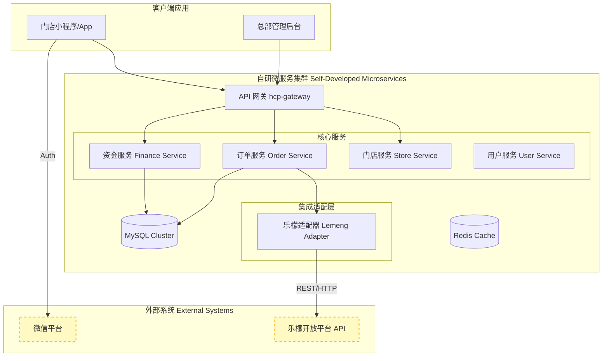
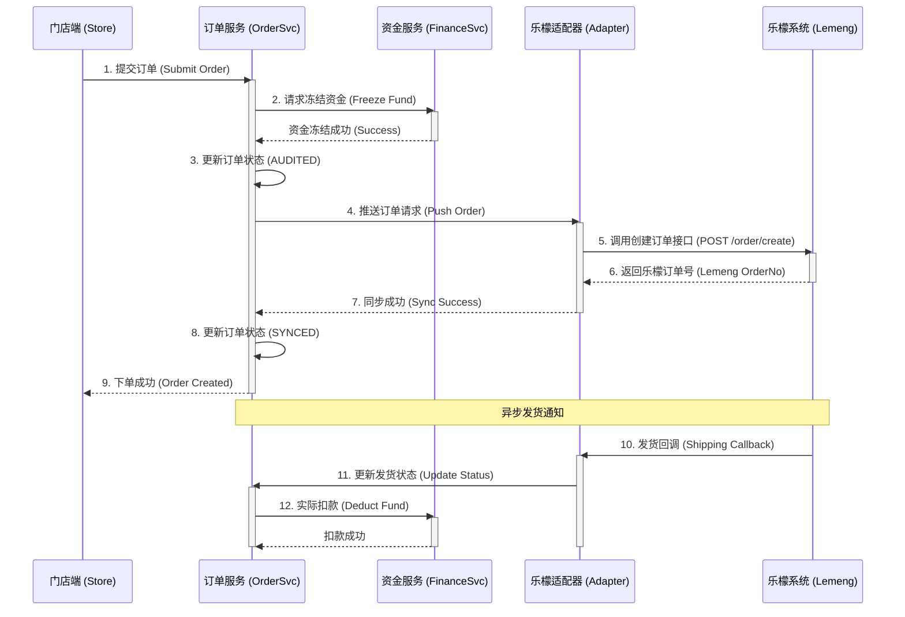

# 05. 系统集成与部署架构 (System Integration & Deployment)

> **文档受众**: 架构师、运维工程师
> **核心目标**: 明确自研系统与外部乐檬供应链系统的集成边界与部署架构。

## 1. 系统组件架构图 (Component Architecture)

系统采用微服务架构，通过适配层与乐檬系统交互。

## 2. 核心接口时序交互 (Interface Sequence Diagram)

以下时序图展示了订货单从自研系统同步至乐檬系统的详细交互过程。

## 3. 集成要点说明

1.  **接口认证**:
    - 自研系统访问乐檬 API 需携带 `AppKey` 和 `Signature`。
    - 乐檬回调自研系统需验证签名，防止伪造回调。

2.  **数据一致性**:
    - **库存**: 自研系统仅做 *镜像库存* 展示，实际下单时需校验乐檬实时库存（或依赖乐檬下单接口返回的库存不足错误）。
    - **状态**: 订单状态以乐檬回调为准，自研系统需实现 *定时任务* 主动查询乐檬订单状态，防止回调丢失。

3.  **异常处理**:
    - 若同步乐檬失败（网络超时等），订单状态置为 `SYNC_FAILED`，支持人工或自动重试。
    - 若乐檬发货数量与订单不符（缺货），按实际发货数量扣款，剩余冻结资金解冻。
