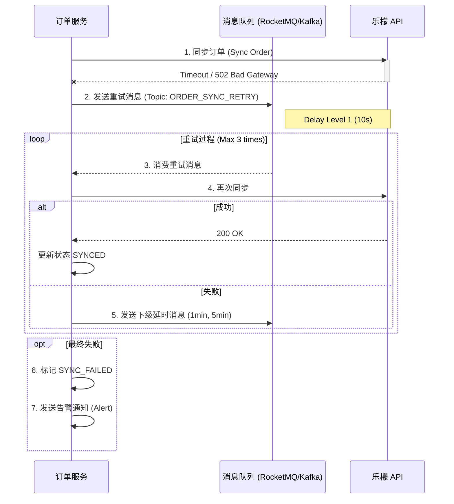
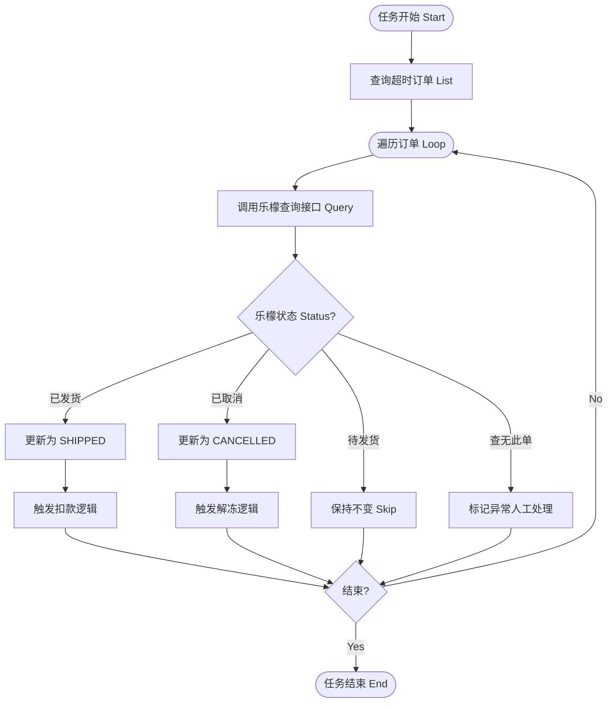

# 06. 异常处理与补偿机制 (Exception Handling & Compensation)

> **文档受众**: 研发人员、运维人员
> **核心目标**: 定义系统在面对网络故障、外部依赖不可用等异常情况时的自动恢复策略。

## 1. 核心异常场景 (Key Exception Scenarios)

| 异常类型 | 场景描述 | 影响范围 | 恢复策略 |
| :--- | :--- | :--- | :--- |
| **同步超时** | 系统调用乐檬 `createOrder` 接口超时或返回 500。 | 订单卡在 `AUDITED`，未产生乐檬单号。 | **自动重试** (指数退避) |
| **回调丢失** | 乐檬已发货，但自研系统未收到 Webhook 通知。 | 订单卡在 `SYNCED`，用户无法确认收货，资金无法解冻扣款。 | **定时轮询** (主动查询) |
| **库存超卖** | 自研校验通过，但乐檬返回库存不足。 | 订单被拒，资金仍处于冻结状态。 | **自动冲正** (关闭订单并解冻) |
| **重复支付** | 网络抖动导致重复扣款请求。 | 账户余额被错误扣除。 | **幂等性设计** (唯一流水号) |

## 2. 自动重试机制 (Retry Mechanism)

针对瞬时网络故障（Transient Errors），采用指数退避策略进行重试。

### 2.1. 同步重试时序图 (Retry Sequence Diagram)



## 3. 定时补偿机制 (Scheduled Compensation)

针对长时间未更新状态的“僵尸订单”，通过定时任务主动向外部系统查询状态，实现“最终一致性”。

### 3.1. 状态补偿活动图 (Compensation Job Activity Diagram)

**任务频率**: 每 30 分钟执行一次。
**查询范围**: 状态为 `SYNCED` 且更新时间超过 2 小时的订单。



## 4. 人工介入兜底 (Manual Intervention)

当自动重试和补偿均无法解决问题时（如数据严重不一致、代码逻辑错误），需提供人工介入工具。

- **后台功能**:
    - **强制完成**: 将订单状态强行置为 `COMPLETED`（仅改状态不扣款，或同时触发扣款）。
    - **强制取消**: 将订单状态强行置为 `CANCELLED` 并释放冻结资金。
    - **手动触发同步**: 针对 `SYNC_FAILED` 的订单，运营人员可点击“立即同步”按钮。

## 5. 幂等性设计 (Idempotency)

所有涉及资金变动的接口，必须通过 `bizId` (业务唯一键) 保证幂等。

```sql
-- 资金流水表唯一索引示例
CREATE UNIQUE INDEX uk_transaction_ref ON transaction_log (ref_no, type);
```

- **扣款接口**: `deduct(orderNo)` -> 检查 `transaction_log` 是否存在 `type=PAY, ref_no=orderNo` 的记录。若存在，直接返回成功。
- **解冻接口**: `unfreeze(orderNo)` -> 检查是否已解冻。

---
*下一篇：请阅读 `07-optimization_extension.md` 了解未来优化方向。*
