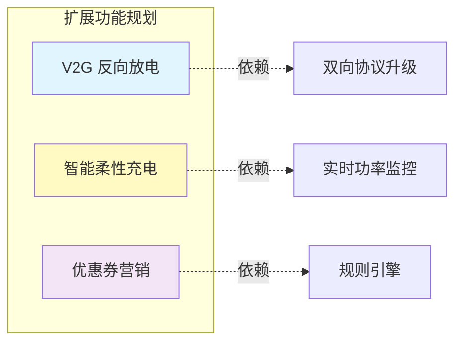

# 06-优化与扩展设计 (Optimization & Extensions)

本章节从产品迭代的角度出发，提出对当前系统的优化建议与未来功能扩展方向。

## 1. 系统优化建议 (Optimization)

### 1.1 性能优化：WebSocket 推送降频
*   **现状**：设备每秒上报一次心跳，服务端即刻向小程序推送一次。
*   **问题**：当并发充电数增多时，不仅占用网络带宽，还会导致前端 UI 频繁刷新闪烁。
*   **优化方案**：
    *   **后端节流**：设置推送频率阈值（如每 5 秒推送一次）。
    *   **前端平滑**：接收到数据后使用缓动动画展示电量增长，而非直接跳变。

### 1.2 体验优化：预授权扣款 (Pre-authorization)
*   **现状**：结束充电后扣款，若用户余额不足则无法即时收回资金。
*   **建议**：引入微信/支付宝支付分或预授权冻结。
    1.  下单时冻结用户 50 元预授权额度。
    2.  充电结束根据实际费用进行结算解冻。
    3.  剩余额度原路退回。

### 1.3 稳定性优化：离线充电策略 (Offline Mode)
*   **现状**：如果断网，无法启动充电。
*   **建议**：
    *   下发白名单至桩端。
    *   允许设备在离线状态下验证用户身份（刷卡/蓝牙）并启动充电。
    *   网络恢复后补传订单数据。

## 2. 未来功能扩展 (Future Extensions)

### 2.1 营销活动系统 (Marketing)
*   **场景**：新用户首单免费、满减券、会员日折扣。
*   **实现**：在 `BillingService` 结算逻辑中增加 `RuleEngine` 规则引擎，计算最终金额前应用优惠策略。

### 2.2 智能负载均衡 (Load Balancing)
*   **场景**：某站点电力容量有限，多车同时充电会导致跳闸。
*   **实现**：
    *   引入“柔性充电”策略。
    *   当总功率接近上限时，动态下发指令降低各桩的输出功率。
    *   优先保障即将充满的车辆或 VIP 用户。

### 2.3 车辆到电网交互 (V2G)
*   **场景**：利用电动车电池作为储能单元，在电网高峰期反向放电获利。
*   **实现**：
    *   升级双向逆变器协议。
    *   增加“放电订单”类型 (`DischargeOrder`)。
    *   结算逻辑改为“平台向用户付费”。

