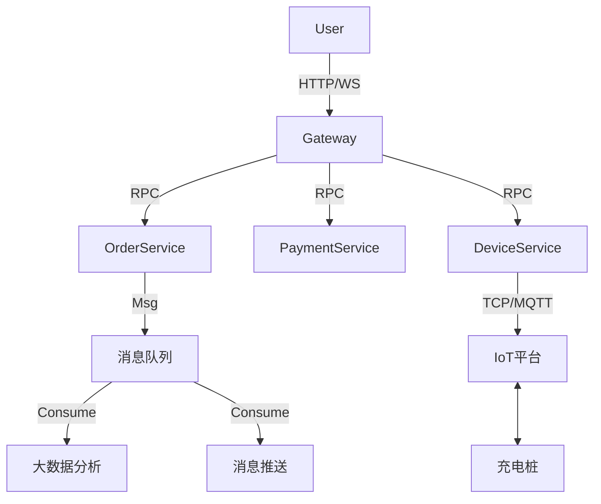

# 06-场景：优化与扩展设计 (Optimization & Extension)

## 1. 场景概述 (Overview)

本章节探讨现有系统架构的瓶颈，并提出针对性的优化方案及未来的业务扩展方向。

### 1.1 场景目标
*   **性能优化 (Performance)**: 提升高并发下单场景下的系统响应速度和稳定性。
*   **功能扩展 (Scalability)**: 支持更多元化的支付方式和更复杂的能源互动场景。

---

## 2. 现有痛点与优化方案 (Current Pain Points & Solutions)

### 2.1 痛点一：并发扣费风险 (Concurrent Deduction Risk)

**问题描述**: 当多个并发请求同时尝试修改用户余额（如：同一账户多台车同时充电结束），可能导致“余额覆盖”或“双重扣费”问题。
**优化方案**:
*   引入 **分布式锁 (Distributed Lock)**: 使用 Redis (Redisson) 对 `userId` 加锁，确保同一时刻只有一个线程能操作该用户的余额。
*   **数据库乐观锁 (Optimistic Locking)**: 在 `MenberBalance` 表增加 `version` 字段，更新时校验版本号。

```java
// 伪代码示例
@Transactional
public void deductBalance(Long userId, BigDecimal amount) {
    RLock lock = redissonClient.getLock("balance:" + userId);
    try {
        lock.lock();
        // 扣费逻辑
    } finally {
        lock.unlock();
    }
}
```

### 2.2 痛点二：硬件通讯延迟 (Hardware Latency)

**问题描述**: 下发启动指令后，需同步等待硬件响应，若网络波动会导致接口超时。
**优化方案**:
*   **全异步架构**:
    1.  接口层直接返回“指令已下发，处理中”。
    2.  通过 MQ (RabbitMQ/RocketMQ) 异步投递指令给硬件网关。
    3.  前端轮询或 WebSocket 监听最终结果。

### 2.3 痛点三：分时计费计算复杂 (Complex Pricing Calculation)

**问题描述**: 每次结算都要实时查库计算分时电价，在高并发下数据库压力大。
**优化方案**:
*   **本地缓存 (Local Cache)**: 将当日的价格策略缓存在应用内存 (Guava/Caffeine) 或 Redis 中，减少查库。

---

## 3. 未来扩展方向 (Future Extensions)

### 3.1 信用支付 (Credit Payment)
*   **当前模式**: 余额预充值。
*   **扩展模式**: 对接 微信支付分 / 支付宝芝麻信用。
    *   用户授权免密支付。
    *   充电结束直接从第三方扣款，无需预充值。

### 3.2 V2G (Vehicle-to-Grid) 车网互动
*   **场景**: 电动汽车作为储能单元，在电网高峰期向电网放电（卖电）。
*   **扩展**:
    *   新增 `DischargeOrder` (放电订单)。
    *   支持双向计量（充电量、放电量）。
    *   反向结算（平台向用户支付费用）。

### 3.3 多商户清分 (Multi-Tenant Settlement)
*   **场景**: 平台接入第三方运营商的桩。
*   **扩展**:
    *   支持“分润规则”配置。
    *   每日自动生成分润账单，与第三方进行资金结算。

---

## 4. 架构演进建议 (Architecture Evolution)



**建议**: 将“硬件连接层”与“业务逻辑层”彻底解耦，通过 MQ 进行削峰填谷，提升系统的整体吞吐量。
