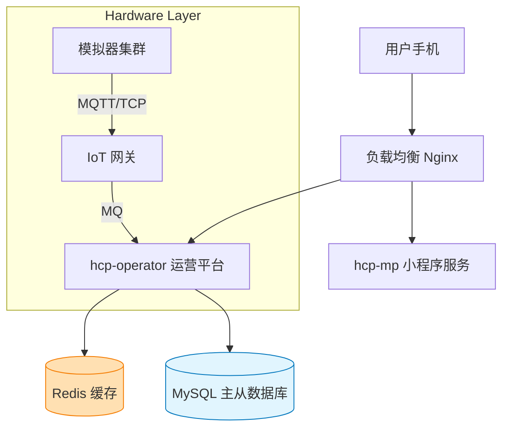

# 06-优化与扩展设计 (Optimization & Extension)

基于当前系统架构的分析，我们提出以下针对性的优化建议与未来扩展方向，旨在提升系统的高并发处理能力、数据可靠性和业务丰富度。

## 1. 架构优化建议 (Architecture Optimization)

### 1.1 引入消息队列 (Message Queue)
目前设备心跳上报 (`heartbeat`) 和指令下发 (`startCharge`) 之间可能存在同步调用或强耦合。随着桩数量增加（例如 1000 个桩每 15 秒上报一次），数据库将面临巨大写入压力。

*   **建议**: 引入 RabbitMQ / RocketMQ。
    *   **上行数据 (Upstream)**: 设备心跳 -> MQ -> 消费者批量写入 DB / 更新 Redis。
    *   **下行指令 (Downstream)**: 业务系统发指令 -> MQ -> 指令网关 -> 设备。
*   **收益**: 削峰填谷，解耦业务逻辑与硬件通信。

### 1.2 Redis 缓存应用 (Caching Strategy)
高频读取的数据（如：设备在线状态、当前费率、进行中的订单）不应频繁查询数据库。

*   **建议**:
    *   `PileStatus`: 使用 Redis `Hash` 存储，设备心跳只更新 Cache，定时任务每分钟刷入 DB。
    *   `ActiveOrder`: 将进行中的订单快照存入 Redis，前端轮询或 WebSocket 推送直接读缓存。

### 1.3 接口幂等性 (Idempotency)
硬件设备可能会因为网络波动重复发送 `startResult` 或 `stopResult` 回调。

*   **建议**: 在处理回调时，先检查订单当前状态。例如：收到 `startResult` 时，若订单已是 `CHARGING`，则直接忽略，防止重复计费或状态异常回滚。

## 2. 功能扩展规划 (Feature Extension)

### 2.1 自动扣费与支付集成
当前系统仅模拟了余额扣除。

*   **规划**:
    1.  **预充值**: 保持现有逻辑。
    2.  **信用支付**: 引入微信支付分/支付宝芝麻信用，实现“先充后付”。
    3.  **支付路由**: 在 `ChargingOrderServiceImpl` 的 `handleOrderInfo` 中，集成支付网关 SDK，实现真正的资金流转。

### 2.2 营销与优惠券 (Marketing)
*   **规划**:
    *   在 `OrderSettle` 阶段引入 `PromotionService`。
    *   设计 `Coupon` 实体，支持满减、折扣、时段优惠（峰谷电价外的额外补贴）。

### 2.3 票据与发票 (Invoice)
*   **规划**:
    *   增加 `InvoiceController`。
    *   用户可勾选多个 `PAYED` 订单合并开具电子发票。

## 3. 部署架构图 (Deployment Diagram)

## 4. 结语

本系列文档通过业务场景拆解、UML 图表可视化及代码逻辑映射，完整梳理了 `hcp` 充电平台的业务脉络。虽然部分细节（如真实支付、异常自动补偿）尚待完善，但核心的“下单-发货-结算”闭环已清晰可见。后续开发应优先关注**异常流程的自动化处理**及**高并发下的数据一致性**。
