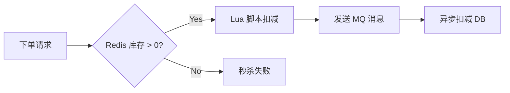
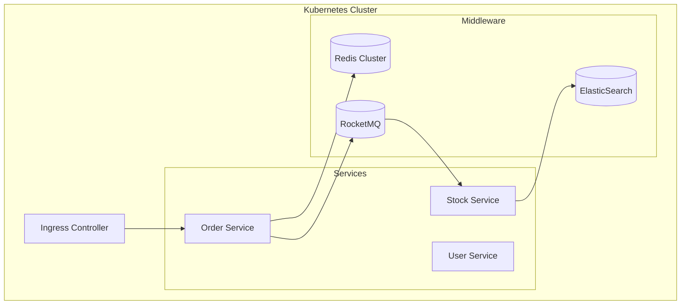

# 07. 系统优化与未来扩展 (Optimization & Extension)

> **文档受众**: 架构师、CTO
> **核心目标**: 阐述系统的性能瓶颈解决方案及长期演进路线。

## 1. 性能优化策略 (Performance Optimization)

针对零售场景的高并发特性（尤其是促销期间），提出以下优化方案。

### 1.1. 库存扣减优化 (Stock Optimization)

**痛点**: 数据库行锁竞争激烈，导致下单 TPS 受限。
**方案**: Redis 预扣减 + 异步落库。

### 1.2. 读写分离架构 (Read/Write Splitting)

**现状**: 单库承载所有读写流量。
**方案**: 主从复制，查询走从库。

- **主库 (Master)**: 处理 `CreateOrder`, `Pay`, `Refund` 等写请求。
- **从库 (Slave)**: 处理 `ListOrders`, `GetReport` 等读请求。

## 2. 系统扩展性设计 (Scalability)

随着门店数量增长（从 500 到 5000+），单表数据量将成倍增加。

### 2.1. 数据库分库分表 (Sharding)

**切分维度**:
- **StoreId**: 适合门店维度的查询（店长看自己）。
- **OrderNo**: 适合根据订单号的点查。
- **Date**: 适合历史归档（冷热分离）。

**推荐方案**: 按 `store_id % 32` 分库，单表控制在 500万行以内。

## 3. 未来业务演进 (Roadmap)

| 阶段 | 核心特性 | 价值点 |
| :--- | :--- | :--- |
| **P1** | **智能补货** | 基于历史销量预测未来需求，自动生成订货单。 | 降低门店缺货率，减少资金占用。 |
| **P2** | **多租户支持** | 支持不同品牌（Tenant）接入同一套 SaaS 平台。 | 商业化输出能力，降低边际成本。 |
| **P3** | **区块链溯源** | 将乐檬发货信息上链，消费者扫码可查。 | 提升品牌信任度，确保商品真伪。 |
| **P4** | **全渠道融合** | 打通线上微商城与线下门店库存（O2O）。 | 提升库存周转率，统一会员体验。 |

## 4. 部署架构升级 (Deployment Architecture)

引入容器化与服务网格。

---
*文档结束。感谢阅读！*
